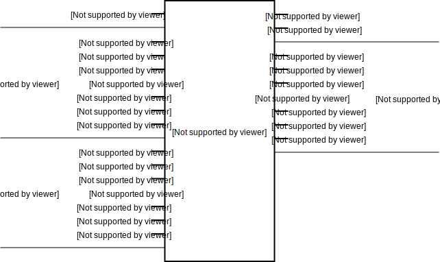

:tocdepth: 2

==========
Arithmetic
==========

.. _Adder4:

Adder4
======

Class ``bw.arithmetic.Adder4``
------------------------------

Defined in `bitwise/arithmetic/ADD.py <https://github.com/jamesjiang52/Bitwise/blob/master/bitwise/arithmetic/ADD.py>`_.

4-bit `adder <https://en.wikipedia.org/wiki/Adder_(electronics)>`_.

__init__
--------

::

    __init__(
        carry_in,
        a_bus,
        b_bus,
        carry_out,
        sum_bus
    )

Construct a new 4-bit adder.

Args:
~~~~~
* ``carry_in``: An object of type ``Wire``. The carry-in to the adder.
* ``a_bus``: An object of type ``Bus4``. The first addend. ``a_bus[0]`` and ``a_bus[3]`` are the most and least significant bit, respectively.
* ``b_bus``: An object of type ``Bus4``. The second addend. ``b_bus[0]`` and ``b_bus[3]`` are the most and least significant bit, respectively.
* ``carry_out``: An object of type ``Wire``. The carry-out of the adder.
* ``sum_bus``: An object of type ``Bus4``. The sum of the two addends. ``sum_bus[0]`` and ``sum_bus[3]`` are the most and least significant bit, respectively.

Raises:
~~~~~~~
* ``TypeError``: If either ``a_bus``, ``b_bus``, or ``sum_bus`` is not a bus of width 4.

.. _Adder8:

Adder8
======

Class ``bw.arithmetic.Adder8``
------------------------------

.. image:: images/schematics/arithmetic/Adder8.svg
    :width: 800px

Defined in `bitwise/arithmetic/ADD.py <https://github.com/jamesjiang52/Bitwise/blob/master/bitwise/arithmetic/ADD.py>`_.

8-bit `adder <https://en.wikipedia.org/wiki/Adder_(electronics)>`_.

__init__
--------

::

    __init__(
        carry_in,
        a_bus,
        b_bus,
        carry_out,
        sum_bus
    )

Construct a new 8-bit adder.

Args:
~~~~~
* ``carry_in``: An object of type ``Wire``. The carry-in to the adder.
* ``a_bus``: An object of type ``Bus8``. The first addend. ``a_bus[0]`` and ``a_bus[7]`` are the most and least significant bit, respectively.
* ``b_bus``: An object of type ``Bus8``. The second addend. ``b_bus[0]`` and ``b_bus[7]`` are the most and least significant bit, respectively.
* ``carry_out``: An object of type ``Wire``. The carry-out of the adder.
* ``sum_bus``: An object of type ``Bus8``. The sum of the two addends. ``sum_bus[0]`` and ``sum_bus[7]`` are the most and least significant bit, respectively.

Raises:
~~~~~~~
* ``TypeError``: If either ``a_bus``, ``b_bus``, or ``sum_bus`` is not a bus of width 8.

.. _Adder16:

Adder16
=======

Class ``bw.arithmetic.Adder16``
-------------------------------

Defined in `bitwise/arithmetic/ADD.py <https://github.com/jamesjiang52/Bitwise/blob/master/bitwise/arithmetic/ADD.py>`_.

16-bit `adder <https://en.wikipedia.org/wiki/Adder_(electronics)>`_.

__init__
--------

::

    __init__(
        carry_in,
        a_bus,
        b_bus,
        carry_out,
        sum_bus
    )

Construct a new 16-bit adder.

Args:
~~~~~
* ``carry_in``: An object of type ``Wire``. The carry-in to the adder.
* ``a_bus``: An object of type ``Bus16``. The first addend. ``a_bus[0]`` and ``a_bus[15]`` are the most and least significant bit, respectively.
* ``b_bus``: An object of type ``Bus16``. The second addend. ``b_bus[0]`` and ``b_bus[15]`` are the most and least significant bit, respectively.
* ``carry_out``: An object of type ``Wire``. The carry-out of the adder.
* ``sum_bus``: An object of type ``Bus16``. The sum of the two addends. ``sum_bus[0]`` and ``sum_bus[15]`` are the most and least significant bit, respectively.

Raises:
~~~~~~~
* ``TypeError``: If either ``a_bus``, ``b_bus``, or ``sum_bus`` is not a bus of width 16.

.. _AdderSubtractor4:

AdderSubtractor4
================

Class ``bw.arithmetic.AdderSubtractor4``
----------------------------------------

.. image:: images/schematics/arithmetic/AdderSubtractor4.svg
    :width: 800px

Defined in `bitwise/arithmetic/ADD_SUB.py <https://github.com/jamesjiang52/Bitwise/blob/master/bitwise/arithmetic/ADD_SUB.py>`_.

4-bit `adder-subtractor <https://en.wikipedia.org/wiki/Adder%E2%80%93subtractor>`_.

__init__
--------

::

    __init__(
        add_subtract,
        a_bus,
        b_bus,
        overflow,
        carry_out,
        sum_bus
    )

Construct a new 4-bit adder-subtractor.

Args:
~~~~~
* ``add_subtract``: An object of type ``Wire``. Indicates the operation to carry out - 0 for addition, 1 for subtraction.
* ``a_bus``: An object of type ``Bus4``. The first addend, or the minuend. ``a_bus[0]`` and ``a_bus[3]`` are the most and least significant bit, respectively. ``a_bus[0]`` is the sign bit in subtraction operations.
* ``b_bus``: An object of type ``Bus4``. The second addend, or the subtrahend. ``b_bus[0]`` and ``b_bus[3]`` are the most and least significant bit, respectively. ``b_bus[0]`` is the sign bit in subtraction operations.
* ``overflow``: An object of type ``Wire``. The overflow indicator of the subtractor.
* ``carry_out``: An object of type ``Wire``. The carry-out of the adder.
* ``sum_bus``: An object of type ``Bus4``. The sum of the two addends, or the difference between the minuend and the subtrahend. ``sum_bus[0]`` and ``sum_bus[3]`` are the most and least significant bit, respectively. ``sum_bus[0]`` is the sign bit in subtraction operations.

Raises:
~~~~~~~
* ``TypeError``: If either ``a_bus``, ``b_bus``, or ``sum_bus`` is not a bus of width 4.

.. _AdderSubtractor8:

AdderSubtractor8
================

Class ``bw.arithmetic.AdderSubtractor8``
----------------------------------------

.. image:: images/schematics/arithmetic/AdderSubtractor8.svg
    :width: 800px

Defined in `bitwise/arithmetic/ADD_SUB.py <https://github.com/jamesjiang52/Bitwise/blob/master/bitwise/arithmetic/ADD_SUB.py>`_.

8-bit `adder-subtractor <https://en.wikipedia.org/wiki/Adder%E2%80%93subtractor>`_.

__init__
--------

::

    __init__(
        add_subtract,
        a_bus,
        b_bus,
        overflow,
        carry_out,
        sum_bus
    )

Construct a new 8-bit adder-subtractor.

Args:
~~~~~
* ``add_subtract``: An object of type ``Wire``. Indicates the operation to carry out - 0 for addition, 1 for subtraction.
* ``a_bus``: An object of type ``Bus8``. The first addend, or the minuend. ``a_bus[0]`` and ``a_bus[7]`` are the most and least significant bit, respectively. ``a_bus[0]`` is the sign bit in subtraction operations.
* ``b_bus``: An object of type ``Bus8``. The second addend, or the subtrahend. ``b_bus[0]`` and ``b_bus[7]`` are the most and least significant bit, respectively. ``b_bus[0]`` is the sign bit in subtraction operations.
* ``overflow``: An object of type ``Wire``. The overflow indicator of the subtractor.
* ``carry_out``: An object of type ``Wire``. The carry-out of the adder.
* ``sum_bus``: An object of type ``Bus8``. The sum of the two addends, or the difference between the minuend and the subtrahend. ``sum_bus[0]`` and ``sum_bus[7]`` are the most and least significant bit, respectively. ``sum_bus[0]`` is the sign bit in subtraction operations.

Raises:
~~~~~~~
* ``TypeError``: If either ``a_bus``, ``b_bus``, or ``sum_bus`` is not a bus of width 8.

.. _AdderSubtractor16:

AdderSubtractor16
=================

Class ``bw.arithmetic.AdderSubtractor16``
-----------------------------------------

Defined in `bitwise/arithmetic/ADD_SUB.py <https://github.com/jamesjiang52/Bitwise/blob/master/bitwise/arithmetic/ADD_SUB.py>`_.

16-bit `adder-subtractor <https://en.wikipedia.org/wiki/Adder%E2%80%93subtractor>`_.

__init__
--------

::

    __init__(
        add_subtract,
        a_bus,
        b_bus,
        overflow,
        carry_out,
        sum_bus
    )

Construct a new 16-bit adder-subtractor.

Args:
~~~~~
* ``add_subtract``: An object of type ``Wire``. Indicates the operation to carry out - 0 for addition, 1 for subtraction.
* ``a_bus``: An object of type ``Bus16``. The first addend, or the minuend. ``a_bus[0]`` and ``a_bus[15]`` are the most and least significant bit, respectively. ``a_bus[0]`` is the sign bit in subtraction operations.
* ``b_bus``: An object of type ``Bus16``. The second addend, or the subtrahend. ``b_bus[0]`` and ``b_bus[15]`` are the most and least significant bit, respectively. ``b_bus[0]`` is the sign bit in subtraction operations.
* ``overflow``: An object of type ``Wire``. The overflow indicator of the subtractor.
* ``carry_out``: An object of type ``Wire``. The carry-out of the adder.
* ``sum_bus``: An object of type ``Bus16``. The sum of the two addends, or the difference between the minuend and the subtrahend. ``sum_bus[0]`` and ``sum_bus[15]`` are the most and least significant bit, respectively. ``sum_bus[0]`` is the sign bit in subtraction operations.

Raises:
~~~~~~~
* ``TypeError``: If either ``a_bus``, ``b_bus``, or ``sum_bus`` is not a bus of width 16.

.. _FullAdder:

FullAdder
=========

Class ``bw.arithmetic.FullAdder``
---------------------------------

.. image:: images/schematics/arithmetic/FullAdder.svg
    :width: 400px

Defined in `bitwise/arithmetic/ADD.py <https://github.com/jamesjiang52/Bitwise/blob/master/bitwise/arithmetic/ADD.py>`_.

`Full adder <https://en.wikipedia.org/wiki/Adder_(electronics)#Full_adder>`_.

__init__
--------

::

    __init__(
        carry_in,
        a,
        b,
        carry_out,
        sum_
    )

Construct a new full adder.

Args:
~~~~~
* ``carry_in``: An object of type ``Wire``. The carry-in to the adder.
* ``a``: An object of type ``Wire``. The first addend.
* ``b``: An object of type ``Wire``. The second addend.
* ``carry_out``: An object of type ``Wire``. The carry-out of the adder.
* ``sum_``: An object of type ``Wire``. The sum of the two addends.

.. _HalfAdder:

HalfAdder
=========

Class ``bw.arithmetic.HalfAdder``
---------------------------------

.. image:: images/schematics/arithmetic/HalfAdder.svg
    :width: 360px

Defined in `bitwise/arithmetic/ADD.py <https://github.com/jamesjiang52/Bitwise/blob/master/bitwise/arithmetic/ADD.py>`_.

`Half adder <https://en.wikipedia.org/wiki/Adder_(electronics)#Half_adder>`_.

__init__
--------

::

    __init__(
        a,
        b,
        carry_out,
        sum_
    )

Construct a new half adder.

Args:
~~~~~
* ``a``: An object of type ``Wire``. The first addend.
* ``b``: An object of type ``Wire``. The second addend.
* ``carry_out``: An object of type ``Wire``. The carry-out of the adder.
* ``sum_``: An object of type ``Wire``. The sum of the two addends.
