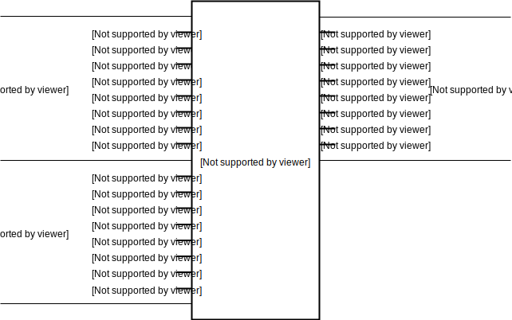
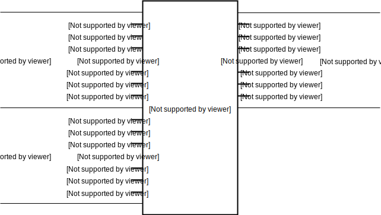
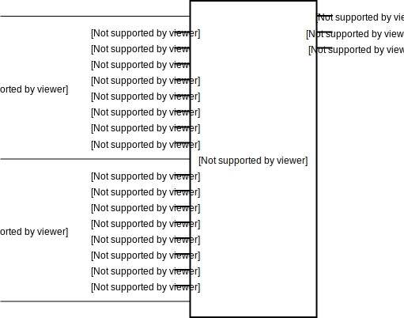
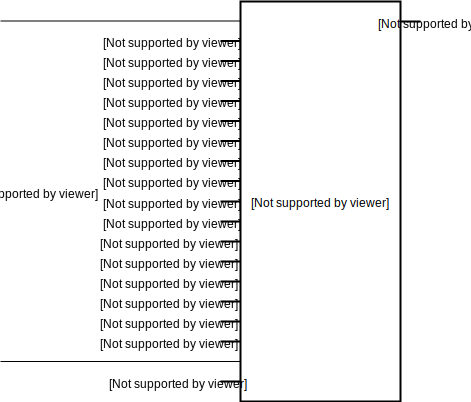

:tocdepth: 2

=====
Logic
=====

.. _BitwiseAND4:

BitwiseAND4
===========

Class ``bw.logic.BitwiseAND4``
------------------------------

Defined in `bitwise/logic/AND.py <https://github.com/jamesjiang52/Bitwise/blob/master/bitwise/logic/AND.py>`_.

4-bit bitwise `AND <https://en.wikipedia.org/wiki/AND_gate>`_ circuit.

__init__
--------

::

    __init__(
        a_bus,
        b_bus,
        output_bus
    )

Construct a new 4-bit bitwise AND circuit.

Args:
~~~~~
* ``a_bus``: An object of type ``Bus4``. The first input.
* ``b_bus``: An object of type ``Bus4``. The second input.
* ``output_bus``: An object of type ``Bus4``. The output of the bitwise AND operation.

Raises:
~~~~~~~
* ``TypeError``: If either ``a_bus``, ``b_bus``, or ``output_bus`` is not a bus of width 4.

.. _BitwiseAND8:

BitwiseAND8
===========

Class ``bw.logic.BitwiseAND8``
------------------------------

Defined in `bitwise/logic/AND.py <https://github.com/jamesjiang52/Bitwise/blob/master/bitwise/logic/AND.py>`_.

8-bit bitwise `AND <https://en.wikipedia.org/wiki/AND_gate>`_ circuit.

__init__
--------

::

    __init__(
        a_bus,
        b_bus,
        output_bus
    )

Construct a new 8-bit bitwise AND circuit.

Args:
~~~~~
* ``a_bus``: An object of type ``Bus8``. The first input.
* ``b_bus``: An object of type ``Bus8``. The second input.
* ``output_bus``: An object of type ``Bus8``. The output of the bitwise AND operation.

Raises:
~~~~~~~
* ``TypeError``: If either ``a_bus``, ``b_bus``, or ``output_bus`` is not a bus of width 8.

.. _BitwiseAND16:

BitwiseAND16
============

Class ``bw.logic.BitwiseAND16``
-------------------------------

Defined in `bitwise/logic/AND.py <https://github.com/jamesjiang52/Bitwise/blob/master/bitwise/logic/AND.py>`_.

16-bit bitwise `AND <https://en.wikipedia.org/wiki/AND_gate>`_ circuit.

__init__
--------

::

    __init__(
        a_bus,
        b_bus,
        output_bus
    )

Construct a new 16-bit bitwise AND circuit.

Args:
~~~~~
* ``a_bus``: An object of type ``Bus16``. The first input.
* ``b_bus``: An object of type ``Bus16``. The second input.
* ``output_bus``: An object of type ``Bus16``. The output of the bitwise AND operation.

Raises:
~~~~~~~
* ``TypeError``: If either ``a_bus``, ``b_bus``, or ``output_bus`` is not a bus of width 16.

.. _BitwiseNAND4:

BitwiseNAND4
============

Class ``bw.logic.BitwiseNAND4``
-------------------------------

Defined in `bitwise/logic/NAND.py <https://github.com/jamesjiang52/Bitwise/blob/master/bitwise/logic/NAND.py>`_.

4-bit bitwise `NAND <https://en.wikipedia.org/wiki/NAND_gate>`_ circuit.

__init__
--------

::

    __init__(
        a_bus,
        b_bus,
        output_bus
    )

Construct a new 4-bit bitwise NAND circuit.

Args:
~~~~~
* ``a_bus``: An object of type ``Bus4``. The first input.
* ``b_bus``: An object of type ``Bus4``. The second input.
* ``output_bus``: An object of type ``Bus4``. The output of the bitwise NAND operation.

Raises:
~~~~~~~
* ``TypeError``: If either ``a_bus``, ``b_bus``, or ``output_bus`` is not a bus of width 4.

.. _BitwiseNAND8:

BitwiseNAND8
============

Class ``bw.logic.BitwiseNAND8``
-------------------------------

Defined in `bitwise/logic/NAND.py <https://github.com/jamesjiang52/Bitwise/blob/master/bitwise/logic/NAND.py>`_.

8-bit bitwise `NAND <https://en.wikipedia.org/wiki/NAND_gate>`_ circuit.

__init__
--------

::

    __init__(
        a_bus,
        b_bus,
        output_bus
    )

Construct a new 8-bit bitwise NAND circuit.

Args:
~~~~~
* ``a_bus``: An object of type ``Bus8``. The first input.
* ``b_bus``: An object of type ``Bus8``. The second input.
* ``output_bus``: An object of type ``Bus8``. The output of the bitwise NAND operation.

Raises:
~~~~~~~
* ``TypeError``: If either ``a_bus``, ``b_bus``, or ``output_bus`` is not a bus of width 8.

.. _BitwiseNAND16:

BitwiseNAND16
=============

Class ``bw.logic.BitwiseNAND16``
--------------------------------

Defined in `bitwise/logic/NAND.py <https://github.com/jamesjiang52/Bitwise/blob/master/bitwise/logic/NAND.py>`_.

16-bit bitwise `NAND <https://en.wikipedia.org/wiki/NAND_gate>`_ circuit.

__init__
--------

::

    __init__(
        a_bus,
        b_bus,
        output_bus
    )

Construct a new 16-bit bitwise NAND circuit.

Args:
~~~~~
* ``a_bus``: An object of type ``Bus16``. The first input.
* ``b_bus``: An object of type ``Bus16``. The second input.
* ``output_bus``: An object of type ``Bus16``. The output of the bitwise NAND operation.

Raises:
~~~~~~~
* ``TypeError``: If either ``a_bus``, ``b_bus``, or ``output_bus`` is not a bus of width 16.

.. _BitwiseNOR4:

BitwiseNOR4
===========

Class ``bw.logic.BitwiseNOR4``
------------------------------

Defined in `bitwise/logic/NOR.py <https://github.com/jamesjiang52/Bitwise/blob/master/bitwise/logic/NOR.py>`_.

4-bit bitwise `NOR <https://en.wikipedia.org/wiki/NOR_gate>`_ circuit.

__init__
--------

::

    __init__(
        a_bus,
        b_bus,
        output_bus
    )

Construct a new 4-bit bitwise NOR circuit.

Args:
~~~~~
* ``a_bus``: An object of type ``Bus4``. The first input.
* ``b_bus``: An object of type ``Bus4``. The second input.
* ``output_bus``: An object of type ``Bus4``. The output of the bitwise NOR operation.

Raises:
~~~~~~~
* ``TypeError``: If either ``a_bus``, ``b_bus``, or ``output_bus`` is not a bus of width 4.

.. _BitwiseNOR8:

BitwiseNOR8
===========

Class ``bw.logic.BitwiseNOR8``
------------------------------

Defined in `bitwise/logic/NOR.py <https://github.com/jamesjiang52/Bitwise/blob/master/bitwise/logic/NOR.py>`_.

8-bit bitwise `NOR <https://en.wikipedia.org/wiki/NOR_gate>`_ circuit.

__init__
--------

::

    __init__(
        a_bus,
        b_bus,
        output_bus
    )

Construct a new 8-bit bitwise NOR circuit.

Args:
~~~~~
* ``a_bus``: An object of type ``Bus8``. The first input.
* ``b_bus``: An object of type ``Bus8``. The second input.
* ``output_bus``: An object of type ``Bus8``. The output of the bitwise NOR operation.

Raises:
~~~~~~~
* ``TypeError``: If either ``a_bus``, ``b_bus``, or ``output_bus`` is not a bus of width 8.

.. _BitwiseNOR16:

BitwiseNOR16
============

Class ``bw.logic.BitwiseNOR16``
-------------------------------

Defined in `bitwise/logic/NOR.py <https://github.com/jamesjiang52/Bitwise/blob/master/bitwise/logic/NOR.py>`_.

16-bit bitwise `NOR <https://en.wikipedia.org/wiki/NOR_gate>`_ circuit.

__init__
--------

::

    __init__(
        a_bus,
        b_bus,
        output_bus
    )

Construct a new 16-bit bitwise NOR circuit.

Args:
~~~~~
* ``a_bus``: An object of type ``Bus16``. The first input.
* ``b_bus``: An object of type ``Bus16``. The second input.
* ``output_bus``: An object of type ``Bus16``. The output of the bitwise NOR operation.

Raises:
~~~~~~~
* ``TypeError``: If either ``a_bus``, ``b_bus``, or ``output_bus`` is not a bus of width 16.

.. _BitwiseNOT4:

BitwiseNOT4
===========

Class ``bw.logic.BitwiseNOT4``
------------------------------

Defined in `bitwise/logic/NOT.py <https://github.com/jamesjiang52/Bitwise/blob/master/bitwise/logic/NOT.py>`_.

4-bit bitwise `NOT <https://en.wikipedia.org/wiki/Inverter_(logic_gate)>`_ circuit.

__init__
--------

::

    __init__(
        input_bus,
        output_bus
    )

Construct a new 4-bit bitwise NOT circuit.

Args:
~~~~~
* ``input_bus``: An object of type ``Bus4``. The input to the bitwise NOT operation.
* ``output_bus``: An object of type ``Bus4``. The output of the bitwise NOT operation.

Raises:
~~~~~~~
* ``TypeError``: If either ``input_bus`` or ``output_bus`` is not a bus of width 4.

.. _BitwiseNOT8:

BitwiseNOT8
===========

Class ``bw.logic.BitwiseNOT8``
------------------------------

Defined in `bitwise/logic/NOT.py <https://github.com/jamesjiang52/Bitwise/blob/master/bitwise/logic/NOT.py>`_.

8-bit bitwise `NOT <https://en.wikipedia.org/wiki/Inverter_(logic_gate)>`_ circuit.

__init__
--------

::

    __init__(
        input_bus,
        output_bus
    )

Construct a new 8-bit bitwise NOT circuit.

Args:
~~~~~
* ``input_bus``: An object of type ``Bus8``. The input to the bitwise NOT operation.
* ``output_bus``: An object of type ``Bus8``. The output of the bitwise NOT operation.

Raises:
~~~~~~~
* ``TypeError``: If either ``input_bus`` or ``output_bus`` is not a bus of width 8.

.. _BitwiseNOT16:

BitwiseNOT16
============

Class ``bw.logic.BitwiseNOT16``
-------------------------------

Defined in `bitwise/logic/NOT.py <https://github.com/jamesjiang52/Bitwise/blob/master/bitwise/logic/NOT.py>`_.

16-bit bitwise `NOT <https://en.wikipedia.org/wiki/Inverter_(logic_gate)>`_ circuit.

__init__
--------

::

    __init__(
        input_bus,
        output_bus
    )

Construct a new 16-bit bitwise NOT circuit.

Args:
~~~~~
* ``input_bus``: An object of type ``Bus16``. The input to the bitwise NOT operation.
* ``output_bus``: An object of type ``Bus16``. The output of the bitwise NOT operation.

Raises:
~~~~~~~
* ``TypeError``: If either ``input_bus`` or ``output_bus`` is not a bus of width 16.

.. _BitwiseOR4:

BitwiseOR4
==========

Class ``bw.logic.BitwiseOR4``
-----------------------------

Defined in `bitwise/logic/OR.py <https://github.com/jamesjiang52/Bitwise/blob/master/bitwise/logic/OR.py>`_.

4-bit bitwise `OR <https://en.wikipedia.org/wiki/OR_gate>`_ circuit.

__init__
--------

::

    __init__(
        a_bus,
        b_bus,
        output_bus
    )

Construct a new 4-bit bitwise OR circuit.

Args:
~~~~~
* ``a_bus``: An object of type ``Bus4``. The first input.
* ``b_bus``: An object of type ``Bus4``. The second input.
* ``output_bus``: An object of type ``Bus4``. The output of the bitwise OR operation.

Raises:
~~~~~~~
* ``TypeError``: If either ``a_bus``, ``b_bus``, or ``output_bus`` is not a bus of width 4.

.. _BitwiseOR8:

BitwiseOR8
==========

Class ``bw.logic.BitwiseOR8``
-----------------------------

Defined in `bitwise/logic/OR.py <https://github.com/jamesjiang52/Bitwise/blob/master/bitwise/logic/OR.py>`_.

8-bit bitwise `OR <https://en.wikipedia.org/wiki/OR_gate>`_ circuit.

__init__
--------

::

    __init__(
        a_bus,
        b_bus,
        output_bus
    )

Construct a new 8-bit bitwise OR circuit.

Args:
~~~~~
* ``a_bus``: An object of type ``Bus8``. The first input.
* ``b_bus``: An object of type ``Bus8``. The second input.
* ``output_bus``: An object of type ``Bus8``. The output of the bitwise OR operation.

Raises:
~~~~~~~
* ``TypeError``: If either ``a_bus``, ``b_bus``, or ``output_bus`` is not a bus of width 8.

.. _BitwiseOR16:

BitwiseOR16
===========

Class ``bw.logic.BitwiseOR16``
------------------------------

Defined in `bitwise/logic/OR.py <https://github.com/jamesjiang52/Bitwise/blob/master/bitwise/logic/OR.py>`_.

16-bit bitwise `OR <https://en.wikipedia.org/wiki/OR_gate>`_ circuit.

__init__
--------

::

    __init__(
        a_bus,
        b_bus,
        output_bus
    )

Construct a new 16-bit bitwise OR circuit.

Args:
~~~~~
* ``a_bus``: An object of type ``Bus16``. The first input.
* ``b_bus``: An object of type ``Bus16``. The second input.
* ``output_bus``: An object of type ``Bus16``. The output of the bitwise OR operation.

Raises:
~~~~~~~
* ``TypeError``: If either ``a_bus``, ``b_bus``, or ``output_bus`` is not a bus of width 16.

.. _BitwiseXNOR4:

BitwiseXNOR4
============

Class ``bw.logic.BitwiseXNOR4``
-------------------------------

Defined in `bitwise/logic/XNOR.py <https://github.com/jamesjiang52/Bitwise/blob/master/bitwise/logic/XNOR.py>`_.

4-bit bitwise `XNOR <https://en.wikipedia.org/wiki/XNOR_gate>`_ circuit.

__init__
--------

::

    __init__(
        a_bus,
        b_bus,
        output_bus
    )

Construct a new 4-bit bitwise XNOR circuit.

Args:
~~~~~
* ``a_bus``: An object of type ``Bus4``. The first input.
* ``b_bus``: An object of type ``Bus4``. The second input.
* ``output_bus``: An object of type ``Bus4``. The output of the bitwise XNOR operation.

Raises:
~~~~~~~
* ``TypeError``: If either ``a_bus``, ``b_bus``, or ``output_bus`` is not a bus of width 4.

.. _BitwiseXNOR8:

BitwiseXNOR8
============

Class ``bw.logic.BitwiseXNOR8``
-------------------------------

Defined in `bitwise/logic/XNOR.py <https://github.com/jamesjiang52/Bitwise/blob/master/bitwise/logic/XNOR.py>`_.

8-bit bitwise `XNOR <https://en.wikipedia.org/wiki/XNOR_gate>`_ circuit.

__init__
--------

::

    __init__(
        a_bus,
        b_bus,
        output_bus
    )

Construct a new 8-bit bitwise XNOR circuit.

Args:
~~~~~
* ``a_bus``: An object of type ``Bus8``. The first input.
* ``b_bus``: An object of type ``Bus8``. The second input.
* ``output_bus``: An object of type ``Bus8``. The output of the bitwise XNOR operation.

Raises:
~~~~~~~
* ``TypeError``: If either ``a_bus``, ``b_bus``, or ``output_bus`` is not a bus of width 8.

.. _BitwiseXNOR16:

BitwiseXNOR16
=============

Class ``bw.logic.BitwiseXNOR16``
--------------------------------

Defined in `bitwise/logic/XNOR.py <https://github.com/jamesjiang52/Bitwise/blob/master/bitwise/logic/XNOR.py>`_.

16-bit bitwise `XNOR <https://en.wikipedia.org/wiki/XNOR_gate>`_ circuit.

__init__
--------

::

    __init__(
        a_bus,
        b_bus,
        output_bus
    )

Construct a new 16-bit bitwise XNOR circuit.

Args:
~~~~~
* ``a_bus``: An object of type ``Bus16``. The first input.
* ``b_bus``: An object of type ``Bus16``. The second input.
* ``output_bus``: An object of type ``Bus16``. The output of the bitwise XNOR operation.

Raises:
~~~~~~~
* ``TypeError``: If either ``a_bus``, ``b_bus``, or ``output_bus`` is not a bus of width 16.

.. _BitwiseXOR4:

BitwiseXOR4
===========

Class ``bw.logic.BitwiseXOR4``
------------------------------

Defined in `bitwise/logic/XOR.py <https://github.com/jamesjiang52/Bitwise/blob/master/bitwise/logic/XOR.py>`_.

4-bit bitwise `XOR <https://en.wikipedia.org/wiki/XOR_gate>`_ circuit.

__init__
--------

::

    __init__(
        a_bus,
        b_bus,
        output_bus
    )

Construct a new 4-bit bitwise XOR circuit.

Args:
~~~~~
* ``a_bus``: An object of type ``Bus4``. The first input.
* ``b_bus``: An object of type ``Bus4``. The second input.
* ``output_bus``: An object of type ``Bus4``. The output of the bitwise XOR operation.

Raises:
~~~~~~~
* ``TypeError``: If either ``a_bus``, ``b_bus``, or ``output_bus`` is not a bus of width 4.

.. _BitwiseXOR8:

BitwiseXOR8
===========

Class ``bw.logic.BitwiseXOR8``
------------------------------

Defined in `bitwise/logic/XOR.py <https://github.com/jamesjiang52/Bitwise/blob/master/bitwise/logic/XOR.py>`_.

8-bit bitwise `XOR <https://en.wikipedia.org/wiki/XOR_gate>`_ circuit.

__init__
--------

::

    __init__(
        a_bus,
        b_bus,
        output_bus
    )

Construct a new 8-bit bitwise XOR circuit.

Args:
~~~~~
* ``a_bus``: An object of type ``Bus8``. The first input.
* ``b_bus``: An object of type ``Bus8``. The second input.
* ``output_bus``: An object of type ``Bus8``. The output of the bitwise XOR operation.

Raises:
~~~~~~~
* ``TypeError``: If either ``a_bus``, ``b_bus``, or ``output_bus`` is not a bus of width 8.

.. _BitwiseXOR16:

BitwiseXOR16
============

Class ``bw.logic.BitwiseXOR16``
-------------------------------

Defined in `bitwise/logic/XOR.py <https://github.com/jamesjiang52/Bitwise/blob/master/bitwise/logic/XOR.py>`_.

16-bit bitwise `XOR <https://en.wikipedia.org/wiki/XOR_gate>`_ circuit.

__init__
--------

::

    __init__(
        a_bus,
        b_bus,
        output_bus
    )

Construct a new 16-bit bitwise XOR circuit.

Args:
~~~~~
* ``a_bus``: An object of type ``Bus16``. The first input.
* ``b_bus``: An object of type ``Bus16``. The second input.
* ``output_bus``: An object of type ``Bus16``. The output of the bitwise XOR operation.

Raises:
~~~~~~~
* ``TypeError``: If either ``a_bus``, ``b_bus``, or ``output_bus`` is not a bus of width 16.

.. _Comparator3:

Comparator3
===========

Class ``bw.logic.Comparator3``
------------------------------

Defined in `bitwise/logic/COMP.py <https://github.com/jamesjiang52/Bitwise/blob/master/bitwise/logic/COMP.py>`_.

3-bit `logical comparator <https://en.wikipedia.org/wiki/Digital_comparator>`_.

__init__
--------

::

    __init__(
        a_bus,
        b_bus,
        greater_than,
        equal_to,
        less_than
    )

Construct a new 3-bit logical comparator.

Args:
~~~~~
* ``a_bus``: An object of type ``Bus4``. The number to be compared. ``a_bus[1]`` and ``a_bus[3]`` are the most and least significant bit, respectively. ``a_bus[0]`` is the sign bit.
* ``b_bus``: An object of type ``Bus4``. The number to be compared against. ``b_bus[1]`` and ``b_bus[3]`` are the most and least significant bit, respectively. ``b_bus[0]`` is the sign bit.
* ``greater_than``: An object of type ``Wire``. The greater-than indicator.
* ``equal_to``: An object of type ``Wire``. The equal-to indicator.
* ``less_than``: An object of type ``Wire``. The less-than indicator.

Raises:
~~~~~~~
* ``TypeError``: If either ``a_bus`` or ``b_bus`` is not a bus of width 4.

.. _Comparator7:

Comparator7
===========

Class ``bw.logic.Comparator7``
------------------------------

Defined in `bitwise/logic/COMP.py <https://github.com/jamesjiang52/Bitwise/blob/master/bitwise/logic/COMP.py>`_.

7-bit `logical comparator <https://en.wikipedia.org/wiki/Digital_comparator>`_.

__init__
--------

::

    __init__(
        a_bus,
        b_bus,
        greater_than,
        equal_to,
        less_than
    )

Construct a new 7-bit logical comparator.

Args:
~~~~~
* ``a_bus``: An object of type ``Bus8``. The number to be compared. ``a_bus[1]`` and ``a_bus[7]`` are the most and least significant bit, respectively. ``a_bus[0]`` is the sign bit.
* ``b_bus``: An object of type ``Bus8``. The number to be compared against. ``b_bus[1]`` and ``b_bus[7]`` are the most and least significant bit, respectively. ``b_bus[0]`` is the sign bit.
* ``greater_than``: An object of type ``Wire``. The greater-than indicator.
* ``equal_to``: An object of type ``Wire``. The equal-to indicator.
* ``less_than``: An object of type ``Wire``. The less-than indicator.

Raises:
~~~~~~~
* ``TypeError``: If either ``a_bus`` or ``b_bus`` is not a bus of width 8.

.. _Comparator15:

Comparator15
============

Class ``bw.logic.Comparator15``
-------------------------------

.. image:: images/schematics/logic/Comparator15.svg
    :width: 600px

Defined in `bitwise/logic/COMP.py <https://github.com/jamesjiang52/Bitwise/blob/master/bitwise/logic/COMP.py>`_.

15-bit `logical comparator <https://en.wikipedia.org/wiki/Digital_comparator>`_.

__init__
--------

::

    __init__(
        a_bus,
        b_bus,
        greater_than,
        equal_to,
        less_than
    )

Construct a new 15-bit logical comparator.

Args:
~~~~~
* ``a_bus``: An object of type ``Bus16``. The number to be compared. ``a_bus[1]`` and ``a_bus[15]`` are the most and least significant bit, respectively. ``a_bus[0]`` is the sign bit.
* ``b_bus``: An object of type ``Bus16``. The number to be compared against. ``b_bus[1]`` and ``b_bus[15]`` are the most and least significant bit, respectively. ``b_bus[0]`` is the sign bit.
* ``greater_than``: An object of type ``Wire``. The greater-than indicator.
* ``equal_to``: An object of type ``Wire``. The equal-to indicator.
* ``less_than``: An object of type ``Wire``. The less-than indicator.

Raises:
~~~~~~~
* ``TypeError``: If either ``a_bus`` or ``b_bus`` is not a bus of width 16.

.. _ParityChecker4:

ParityChecker4
==============

Class ``bw.logic.ParityChecker4``
---------------------------------

Defined in `bitwise/logic/PAR.py <https://github.com/jamesjiang52/Bitwise/blob/master/bitwise/logic/PAR.py>`_.

4-bit `even parity checker <https://en.wikipedia.org/wiki/Parity_bit>`_.

__init__
--------

::

    __init__(
        input_bus,
        parity_bit,
        error
    )

Construct a new 4-bit even parity checker.

Args:
~~~~~
* ``input_bus``: An object of type ``Bus4``. The input to the parity checker.
* ``parity_bit``: An object of type ``Wire``. The parity bit.
* ``error``: An object of type ``Wire``. The error indicator.

Raises:
~~~~~~~
* ``TypeError``: If ``input_bus`` is not a bus of width 4.

.. _ParityChecker8:

ParityChecker8
==============

Class ``bw.logic.ParityChecker8``
---------------------------------

Defined in `bitwise/logic/PAR.py <https://github.com/jamesjiang52/Bitwise/blob/master/bitwise/logic/PAR.py>`_.

8-bit `even parity checker <https://en.wikipedia.org/wiki/Parity_bit>`_.

__init__
--------

::

    __init__(
        input_bus,
        parity_bit,
        error
    )

Construct a new 8-bit even parity checker.

Args:
~~~~~
* ``input_bus``: An object of type ``Bus8``. The input to the parity checker.
* ``parity_bit``: An object of type ``Wire``. The parity bit.
* ``error``: An object of type ``Wire``. The error indicator.

Raises:
~~~~~~~
* ``TypeError``: If ``input_bus`` is not a bus of width 8.

.. _ParityChecker16:

ParityChecker16
===============

Class ``bw.logic.ParityChecker16``
----------------------------------

Defined in `bitwise/logic/PAR.py <https://github.com/jamesjiang52/Bitwise/blob/master/bitwise/logic/PAR.py>`_.

16-bit `even parity checker <https://en.wikipedia.org/wiki/Parity_bit>`_.

__init__
--------

::

    __init__(
        input_bus,
        parity_bit,
        error
    )

Construct a new 16-bit even parity checker.

Args:
~~~~~
* ``input_bus``: An object of type ``Bus16``. The input to the parity checker.
* ``parity_bit``: An object of type ``Wire``. The parity bit.
* ``error``: An object of type ``Wire``. The error indicator.

Raises:
~~~~~~~
* ``TypeError``: If ``input_bus`` is not a bus of width 16.

.. _ParityGenerator4:

ParityGenerator4
================

Class ``bw.logic.ParityGenerator4``
-----------------------------------

Defined in `bitwise/logic/PAR.py <https://github.com/jamesjiang52/Bitwise/blob/master/bitwise/logic/PAR.py>`_.

4-bit `even parity generator <https://en.wikipedia.org/wiki/Parity_bit>`_.

__init__
--------

::

    __init__(
        input_bus,
        parity_bit
    )

Construct a new 4-bit even parity generator.

Args:
~~~~~
* ``input_bus``: An object of type ``Bus4``. The input to the parity generator.
* ``parity_bit``: An object of type ``Wire``. The parity bit.

Raises:
~~~~~~~
* ``TypeError``: If ``input_bus`` is not a bus of width 4.

.. _ParityGenerator8:

ParityGenerator8
================

Class ``bw.logic.ParityGenerator8``
-----------------------------------

Defined in `bitwise/logic/PAR.py <https://github.com/jamesjiang52/Bitwise/blob/master/bitwise/logic/PAR.py>`_.

8-bit `even parity generator <https://en.wikipedia.org/wiki/Parity_bit>`_.

__init__
--------

::

    __init__(
        input_bus,
        parity_bit
    )

Construct a new 8-bit even parity generator.

Args:
~~~~~
* ``input_bus``: An object of type ``Bus8``. The input to the parity generator.
* ``parity_bit``: An object of type ``Wire``. The parity bit.

Raises:
~~~~~~~
* ``TypeError``: If ``input_bus`` is not a bus of width 8.

.. _ParityGenerator16:

ParityGenerator16
=================

Class ``bw.logic.ParityGenerator16``
------------------------------------

Defined in `bitwise/logic/PAR.py <https://github.com/jamesjiang52/Bitwise/blob/master/bitwise/logic/PAR.py>`_.

16-bit `even parity generator <https://en.wikipedia.org/wiki/Parity_bit>`_.

__init__
--------

::

    __init__(
        input_bus,
        parity_bit
    )

Construct a new 16-bit even parity generator.

Args:
~~~~~
* ``input_bus``: An object of type ``Bus16``. The input to the parity generator.
* ``parity_bit``: An object of type ``Wire``. The parity bit.

Raises:
~~~~~~~
* ``TypeError``: If ``input_bus`` is not a bus of width 16.
