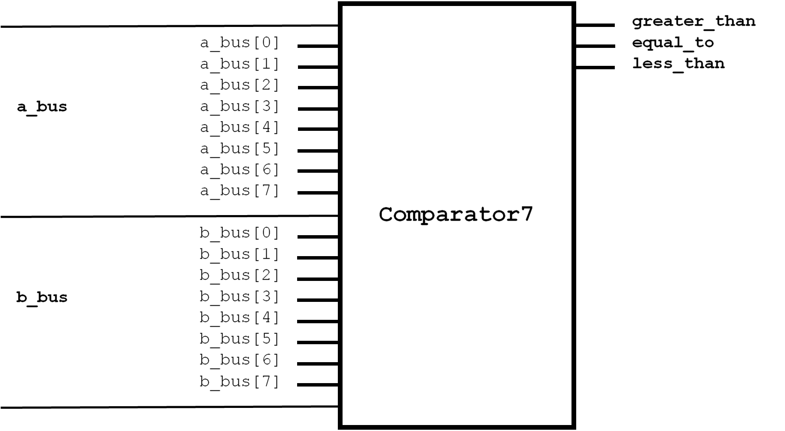
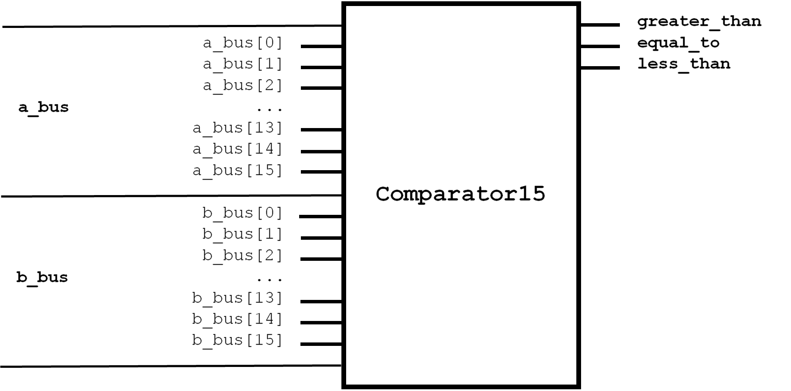

:tocdepth: 2

=====
Logic
=====

.. _Comparator3:

Comparator3
===========

Class ``bw.logic.Comparator3``
------------------------------

Defined in `bitwise/logic/COMP.py <https://github.com/jamesjiang52/Bitwise/blob/master/bitwise/logic/COMP.py>`_.

3-bit `logical comparator <https://en.wikipedia.org/wiki/Digital_comparator>`_.

__init__
--------

::

    __init__(
        a_bus,
        b_bus,
        greater_than,
        equal_to,
        less_than
    )

Construct a new 3-bit logical comparator.

Args:
~~~~~
* ``a_bus``: An object of type ``Bus4``. The number to be compared. ``a_bus[1]`` and ``a_bus[3]`` are the most and least significant bit, respectively. ``a_bus[0]`` is the sign bit.
* ``b_bus``: An object of type ``Bus4``. The number to be compared against. ``b_bus[1]`` and ``b_bus[3]`` are the most and least significant bit, respectively. ``b_bus[0]`` is the sign bit.
* ``greater_than``: An object of type ``Wire``. The greater-than indicator.
* ``equal_to``: An object of type ``Wire``. The equal-to indicator.
* ``less_than``: An object of type ``Wire``. The less-than indicator.

Raises:
~~~~~~~
* ``TypeError``: If either ``a_bus`` or ``b_bus`` is not a bus of width 4.

.. _Comparator7:

Comparator7
===========

Class ``bw.logic.Comparator7``
------------------------------

Defined in `bitwise/logic/COMP.py <https://github.com/jamesjiang52/Bitwise/blob/master/bitwise/logic/COMP.py>`_.

7-bit `logical comparator <https://en.wikipedia.org/wiki/Digital_comparator>`_.

__init__
--------

::

    __init__(
        a_bus,
        b_bus,
        greater_than,
        equal_to,
        less_than
    )

Construct a new 7-bit logical comparator.

Args:
~~~~~
* ``a_bus``: An object of type ``Bus8``. The number to be compared. ``a_bus[1]`` and ``a_bus[7]`` are the most and least significant bit, respectively. ``a_bus[0]`` is the sign bit.
* ``b_bus``: An object of type ``Bus8``. The number to be compared against. ``b_bus[1]`` and ``b_bus[7]`` are the most and least significant bit, respectively. ``b_bus[0]`` is the sign bit.
* ``greater_than``: An object of type ``Wire``. The greater-than indicator.
* ``equal_to``: An object of type ``Wire``. The equal-to indicator.
* ``less_than``: An object of type ``Wire``. The less-than indicator.

Raises:
~~~~~~~
* ``TypeError``: If either ``a_bus`` or ``b_bus`` is not a bus of width 8.

.. _Comparator15:

Comparator15
============

Class ``bw.logic.Comparator15``
-------------------------------

Defined in `bitwise/logic/COMP.py <https://github.com/jamesjiang52/Bitwise/blob/master/bitwise/logic/COMP.py>`_.

15-bit `logical comparator <https://en.wikipedia.org/wiki/Digital_comparator>`_.

__init__
--------

::

    __init__(
        a_bus,
        b_bus,
        greater_than,
        equal_to,
        less_than
    )

Construct a new 15-bit logical comparator.

Args:
~~~~~
* ``a_bus``: An object of type ``Bus16``. The number to be compared. ``a_bus[1]`` and ``a_bus[15]`` are the most and least significant bit, respectively. ``a_bus[0]`` is the sign bit.
* ``b_bus``: An object of type ``Bus16``. The number to be compared against. ``b_bus[1]`` and ``b_bus[15]`` are the most and least significant bit, respectively. ``b_bus[0]`` is the sign bit.
* ``greater_than``: An object of type ``Wire``. The greater-than indicator.
* ``equal_to``: An object of type ``Wire``. The equal-to indicator.
* ``less_than``: An object of type ``Wire``. The less-than indicator.

Raises:
~~~~~~~
* ``TypeError``: If either ``a_bus`` or ``b_bus`` is not a bus of width 16.

.. _ParityChecker4:

ParityChecker4
==============

Class ``bw.logic.ParityChecker4``
---------------------------------

Defined in `bitwise/logic/PAR.py <https://github.com/jamesjiang52/Bitwise/blob/master/bitwise/logic/PAR.py>`_.

4-bit `even parity checker <https://en.wikipedia.org/wiki/Parity_bit>`_.

__init__
--------

::

    __init__(
        input_bus,
        parity_bit,
        error
    )

Construct a new 4-bit even parity checker.

Args:
~~~~~
* ``input_bus``: An object of type ``Bus4``. The input to the parity checker.
* ``parity_bit``: An object of type ``Wire``. The parity bit.
* ``error``: An object of type ``Wire``. The error indicator.

Raises:
~~~~~~~
* ``TypeError``: If ``input_bus`` is not a bus of width 4.

.. _ParityChecker8:

ParityChecker8
==============

Class ``bw.logic.ParityChecker8``
---------------------------------

Defined in `bitwise/logic/PAR.py <https://github.com/jamesjiang52/Bitwise/blob/master/bitwise/logic/PAR.py>`_.

8-bit `even parity checker <https://en.wikipedia.org/wiki/Parity_bit>`_.

__init__
--------

::

    __init__(
        input_bus,
        parity_bit,
        error
    )

Construct a new 8-bit even parity checker.

Args:
~~~~~
* ``input_bus``: An object of type ``Bus8``. The input to the parity checker.
* ``parity_bit``: An object of type ``Wire``. The parity bit.
* ``error``: An object of type ``Wire``. The error indicator.

Raises:
~~~~~~~
* ``TypeError``: If ``input_bus`` is not a bus of width 8.

.. _ParityChecker16:

ParityChecker16
===============

Class ``bw.logic.ParityChecker16``
----------------------------------

Defined in `bitwise/logic/PAR.py <https://github.com/jamesjiang52/Bitwise/blob/master/bitwise/logic/PAR.py>`_.

16-bit `even parity checker <https://en.wikipedia.org/wiki/Parity_bit>`_.

__init__
--------

::

    __init__(
        input_bus,
        parity_bit,
        error
    )

Construct a new 16-bit even parity checker.

Args:
~~~~~
* ``input_bus``: An object of type ``Bus16``. The input to the parity checker.
* ``parity_bit``: An object of type ``Wire``. The parity bit.
* ``error``: An object of type ``Wire``. The error indicator.

Raises:
~~~~~~~
* ``TypeError``: If ``input_bus`` is not a bus of width 16.

.. _ParityGenerator4:

ParityGenerator4
================

Class ``bw.logic.ParityGenerator4``
-----------------------------------

Defined in `bitwise/logic/PAR.py <https://github.com/jamesjiang52/Bitwise/blob/master/bitwise/logic/PAR.py>`_.

4-bit `even parity generator <https://en.wikipedia.org/wiki/Parity_bit>`_.

__init__
--------

::

    __init__(
        input_bus,
        parity_bit,
        error
    )

Construct a new 4-bit even parity generator.

Args:
~~~~~
* ``input_bus``: An object of type ``Bus4``. The input to the parity generator.
* ``parity_bit``: An object of type ``Wire``. The parity bit.

Raises:
~~~~~~~
* ``TypeError``: If ``input_bus`` is not a bus of width 4.

.. _ParityGenerator8:

ParityGenerator8
================

Class ``bw.logic.ParityGenerator8``
-----------------------------------

Defined in `bitwise/logic/PAR.py <https://github.com/jamesjiang52/Bitwise/blob/master/bitwise/logic/PAR.py>`_.

8-bit `even parity generator <https://en.wikipedia.org/wiki/Parity_bit>`_.

__init__
--------

::

    __init__(
        input_bus,
        parity_bit,
        error
    )

Construct a new 8-bit even parity generator.

Args:
~~~~~
* ``input_bus``: An object of type ``Bus8``. The input to the parity generator.
* ``parity_bit``: An object of type ``Wire``. The parity bit.

Raises:
~~~~~~~
* ``TypeError``: If ``input_bus`` is not a bus of width 8.

.. _ParityGenerator16:

ParityGenerator16
=================

Class ``bw.logic.ParityGenerator16``
------------------------------------

.. image:: images/schematics/logic/ParityGenerator16.png
    :width: 600px

Defined in `bitwise/logic/PAR.py <https://github.com/jamesjiang52/Bitwise/blob/master/bitwise/logic/PAR.py>`_.

16-bit `even parity generator <https://en.wikipedia.org/wiki/Parity_bit>`_.

__init__
--------

::

    __init__(
        input_bus,
        parity_bit,
        error
    )

Construct a new 16-bit even parity generator.

Args:
~~~~~
* ``input_bus``: An object of type ``Bus16``. The input to the parity generator.
* ``parity_bit``: An object of type ``Wire``. The parity bit.

Raises:
~~~~~~~
* ``TypeError``: If ``input_bus`` is not a bus of width 16.
