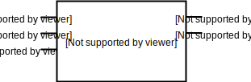

:tocdepth: 2

======
Signal
======

.. _ControlledInverter4:

ControlledInverter4
===================

Class ``bw.signal.ControlledInverter4``
---------------------------------------

Defined in `bitwise/signal/INV_CTRL.py <https://github.com/jamesjiang52/Bitwise/blob/master/bitwise/signal/INV_CTRL.py>`_.

4-bit `controlled inverter <https://en.wikiversity.org/wiki/Logic_gates/XOR>`_.

__init__
--------

::

    __init__(
        enable,
        input_bus,
        output_bus
    )

Construct a new 4-bit controlled inverter.

Args:
~~~~~
* ``enable``: An object of type ``Wire``. Enables the controlled inverter.
* ``input_bus``: An object of type ``Bus4``. The data input to the controlled inverter. 
* ``output_bus``: An object of type ``Bus4``. The output of the controlled inverter, which is the inverted form of the data input iff ``enable`` has value 1.

Raises:
~~~~~~~
* ``TypeError``: If either ``input_bus`` or ``output_bus`` is not a bus of width 4.

.. _ControlledInverter8:

ControlledInverter8
===================

Class ``bw.signal.ControlledInverter8``
---------------------------------------

Defined in `bitwise/signal/INV_CTRL.py <https://github.com/jamesjiang52/Bitwise/blob/master/bitwise/signal/INV_CTRL.py>`_.

8-bit `controlled inverter <https://en.wikiversity.org/wiki/Logic_gates/XOR>`_.

__init__
--------

::

    __init__(
        enable,
        input_bus,
        output_bus
    )

Construct a new 8-bit controlled inverter.

Args:
~~~~~
* ``enable``: An object of type ``Wire``. Enables the controlled inverter.
* ``input_bus``: An object of type ``Bus8``. The data input to the controlled inverter. 
* ``output_bus``: An object of type ``Bus8``. The output of the controlled inverter, which is the inverted form of the data input iff ``enable`` has value 1.

Raises:
~~~~~~~
* ``TypeError``: If either ``input_bus`` or ``output_bus`` is not a bus of width 8.

.. _ControlledInverter16:

ControlledInverter16
====================

Class ``bw.signal.ControlledInverter16``
----------------------------------------

.. image:: images/schematics/signal/ControlledInverter16.svg
    :width: 800px

Defined in `bitwise/signal/INV_CTRL.py <https://github.com/jamesjiang52/Bitwise/blob/master/bitwise/signal/INV_CTRL.py>`_.

16-bit `controlled inverter <https://en.wikiversity.org/wiki/Logic_gates/XOR>`_.

__init__
--------

::

    __init__(
        enable,
        input_bus,
        output_bus
    )

Construct a new 16-bit controlled inverter.

Args:
~~~~~
* ``enable``: An object of type ``Wire``. Enables the controlled inverter.
* ``input_bus``: An object of type ``Bus16``. The data input to the controlled inverter. 
* ``output_bus``: An object of type ``Bus16``. The output of the controlled inverter, which is the inverted form of the data input iff ``enable`` has value 1.

Raises:
~~~~~~~
* ``TypeError``: If either ``input_bus`` or ``output_bus`` is not a bus of width 16.

.. _Decoder1Of4:

Decoder1Of4
===========

Class ``bw.signal.Decoder1Of4``
-------------------------------

.. image:: images/schematics/signal/Decoder1Of4.svg
    :width: 600px

Defined in `bitwise/signal/DEC.py <https://github.com/jamesjiang52/Bitwise/blob/master/bitwise/signal/DEC.py>`_.

1-of-4 `decoder <https://en.wikipedia.org/wiki/Binary_decoder>`_.

__init__
--------

::

    __init__(
        enable,
        input_1,
        input_2,
        output_bus
    )

Construct a new 1-of-4 decoder.

Args:
~~~~~
* ``enable``: An object of type ``Wire``. Enables the decoder.
* ``input_1``: An object of type ``Wire``. The most significant bit of the data input.
* ``input_2``: An object of type ``Wire``. The least significant bit of the data input.
* ``output_bus``: An object of type ``Bus4``. A one-hot encoded value of the input, with ``output_bus[0]`` corresponding to a (1, 1) input and ``output_bus[3]`` corresponding to a (0, 0) input.

Raises:
~~~~~~~
* ``TypeError``: If ``output_bus`` is not a bus of width 4.

.. _Decoder1Of8:

Decoder1Of8
===========

Class ``bw.signal.Decoder1Of8``
-------------------------------

Defined in `bitwise/signal/DEC.py <https://github.com/jamesjiang52/Bitwise/blob/master/bitwise/signal/DEC.py>`_.

1-of-8 `decoder <https://en.wikipedia.org/wiki/Binary_decoder>`_.

__init__
--------

::

    __init__(
        enable,
        input_1,
        input_2,
        input_3,
        output_bus
    )

Construct a new 1-of-8 decoder.

Args:
~~~~~
* ``enable``: An object of type ``Wire``. Enables the decoder.
* ``input_1``: An object of type ``Wire``. The most significant bit of the data input.
* ``input_2``: An object of type ``Wire``.
* ``input_3``: An object of type ``Wire``. The least significant bit of the data input.
* ``output_bus``: An object of type ``Bus8``. A one-hot encoded value of the data input, with ``output_bus[0]`` corresponding to a (1, 1, 1) input and ``output_bus[7]`` corresponding to a (0, 0, 0) input.

Raises:
~~~~~~~
* ``TypeError``: If ``output_bus`` is not a bus of width 8.

.. _Decoder1Of16:

Decoder1Of16
============

Class ``bw.signal.Decoder1Of16``
--------------------------------

.. image:: images/schematics/signal/Decoder1Of16.svg
    :width: 800px

Defined in `bitwise/signal/DEC.py <https://github.com/jamesjiang52/Bitwise/blob/master/bitwise/signal/DEC.py>`_.

1-of-16 `decoder <https://en.wikipedia.org/wiki/Binary_decoder>`_.

__init__
--------

::

    __init__(
        enable,
        input_bus,
        output_bus
    )

Construct a new 1-of-16 decoder.

Args:
~~~~~
* ``enable``: An object of type ``Wire``. Enables the decoder.
* ``input_bus``: An object of type ``Bus4``. The data input to the decoder. ``input_bus[0]`` and ``input_bus[3]`` are the most and least significant bit, respectively.
* ``output_bus``: An object of type ``Bus16``. A one-hot encoded value of the input, with ``output_bus[0]`` corresponding to a (1, 1, 1, 1) input and ``output_bus[15]`` corresponding to a (0, 0, 0, 0) input.

Raises:
~~~~~~~
* ``TypeError``: If ``input_bus`` is not a bus of width 4, or if ``output_bus`` is not a bus of width 16.

.. _Demultiplexer1To2:

Demultiplexer1To2
=================

Class ``bw.signal.Demultiplexer1To2``
-------------------------------------

Defined in `bitwise/signal/DEMUX.py <https://github.com/jamesjiang52/Bitwise/blob/master/bitwise/signal/DEMUX.py>`_.

1-to-2 `demultiplexer <https://en.wikipedia.org/wiki/Multiplexer#Digital_demultiplexers>`_.

__init__
--------

::

    __init__(
        enable,
        select,
        input_,
        output_1,
        output_2
    )

Construct a new 1-to-2 demultiplexer.

Args:
~~~~~
* ``enable``: An object of type ``Wire``. Enables the demultiplexer.
* ``select``: An object of type ``Wire``. The select input.
* ``input_``: An object of type ``Wire``. The data input to the demultiplexer.
* ``output_1``: An object of type ``Wire``. Takes on the value of ``input_`` if the value of ``select`` is 1.
* ``output_2``: An object of type ``Wire``. Takes on the value of ``input_`` if the value of ``select`` is 0.

.. _Demultiplexer1To4:

Demultiplexer1To4
=================

Class ``bw.signal.Demultiplexer1To4``
-------------------------------------

Defined in `bitwise/signal/DEMUX.py <https://github.com/jamesjiang52/Bitwise/blob/master/bitwise/signal/DEMUX.py>`_.

1-to-4 `demultiplexer <https://en.wikipedia.org/wiki/Multiplexer#Digital_demultiplexers>`_.

__init__
--------

::

    __init__(
        enable,
        select_1,
        select_2,
        input_,
        output_bus
    )

Construct a new 1-to-4 demultiplexer.

Args:
~~~~~
* ``enable``: An object of type ``Wire``. Enables the demultiplexer.
* ``select_1``: An object of type ``Wire``. The most significant bit of the select input.
* ``select_2``: An object of type ``Wire``. The least significant bit of the select input.
* ``input_``: An object of type ``Wire``. The data input to the demultiplexer.
* ``output_bus``: An object of type ``Bus4``. ``output_bus[0]`` takes on the value of ``input_`` for a (1, 1) select, and ``output_bus[3]`` takes on the value of ``input_`` for a (0, 0) select.

Raises:
~~~~~~~
* ``TypeError``: If ``output_bus`` is not a bus of width 4.

.. _Demultiplexer1To8:

Demultiplexer1To8
=================

Class ``bw.signal.Demultiplexer1To8``
-------------------------------------

.. image:: images/schematics/signal/Demultiplexer1To8.svg
    :width: 600px

Defined in `bitwise/signal/DEMUX.py <https://github.com/jamesjiang52/Bitwise/blob/master/bitwise/signal/DEMUX.py>`_.

1-to-8 `demultiplexer <https://en.wikipedia.org/wiki/Multiplexer#Digital_demultiplexers>`_.

__init__
--------

::

    __init__(
        enable,
        select_1,
        select_2,
        select_3,
        input_,
        output_bus
    )

Construct a new 1-to-8 demultiplexer.

Args:
~~~~~
* ``enable``: An object of type ``Wire``. Enables the demultiplexer.
* ``select_1``: An object of type ``Wire``. The most significant bit of the select input.
* ``select_2``: An object of type ``Wire``.
* ``select_3``: An object of type ``Wire``. The least significant bit of the select input.
* ``input_``: An object of type ``Wire``. The data input to the demultiplexer.
* ``output_bus``: An object of type ``Bus8``. ``output_bus[0]`` takes on the value of ``input_`` for a (1, 1, 1) select, and ``output_bus[7]`` takes on the value of ``input_`` for a (0, 0, 0) select.

Raises:
~~~~~~~
* ``TypeError``: If ``output_bus`` is not a bus of width 8.

.. _Demultiplexer1To16:

Demultiplexer1To16
==================

Class ``bw.signal.Demultiplexer1To16``
--------------------------------------

Defined in `bitwise/signal/DEMUX.py <https://github.com/jamesjiang52/Bitwise/blob/master/bitwise/signal/DEMUX.py>`_.

1-to-16 `demultiplexer <https://en.wikipedia.org/wiki/Multiplexer#Digital_demultiplexers>`_.

__init__
--------

::

    __init__(
        enable,
        select_bus,
        input_,
        output_bus
    )

Construct a new 1-to-16 demultiplexer.

Args:
~~~~~
* ``enable``: An object of type ``Wire``. Enables the demultiplexer.
* ``select_bus``: An object of type ``Bus4``. The select input to the demultiplexer. ``select_bus[0]`` and ``select_bus[3]`` are the most and least significant bit, respectively.
* ``input_``: An object of type ``Wire``. The data input to the demultiplexer.
* ``output_bus``: An object of type ``Bus16``. ``output_bus[0]`` takes on the value of ``input_`` for a (1, 1, 1, 1) select, and ``output_bus[15]`` takes on the value of ``input_`` for a (0, 0, 0, 0) select.

Raises:
~~~~~~~
* ``TypeError``: If ``select_bus`` is not a bus of width 4, or if ``output_bus`` is not a bus of width 16.

.. _Encoder4To2:

Encoder4To2
===========

Class ``bw.signal.Encoder4To2``
-------------------------------

.. image:: images/schematics/signal/Encoder4To2.svg
    :width: 600px

Defined in `bitwise/signal/ENC.py <https://github.com/jamesjiang52/Bitwise/blob/master/bitwise/signal/ENC.py>`_.

4-to-2 `priority encoder <https://en.wikipedia.org/wiki/Priority_encoder>`_.

__init__
--------

::

    __init__(
        enable,
        input_bus,
        valid,
        output_1,
        output_2
    )

Construct a new 4-to-2 priority encoder.

Args:
~~~~~
* ``enable``: An object of type ``Wire``. Enables the encoder.
* ``input_bus``: An object of type ``Bus4``. The data input to the encoder. ``input_bus[0]`` corresponds to an input value of 3, and ``input_bus[3]`` corresponds to an input value of 0.
* ``valid``: An object of type ``Wire``. The valid indicator. Only takes on the value 0 if all the wires in ``input_bus`` have value 0.
* ``output_1``: An object of type ``Wire``. The most significant bit of the output.
* ``output_2``: An object of type ``Wire``. The least significant bit of the output.

Raises:
~~~~~~~
* ``TypeError``: If ``input_bus`` is not a bus of width 4.

.. _Encoder8To3:

Encoder8To3
===========

Class ``bw.signal.Encoder8To3``
-------------------------------

Defined in `bitwise/signal/ENC.py <https://github.com/jamesjiang52/Bitwise/blob/master/bitwise/signal/ENC.py>`_.

8-to-3 `priority encoder <https://en.wikipedia.org/wiki/Priority_encoder>`_.

__init__
--------

::

    __init__(
        enable,
        input_bus,
        valid,
        output_1,
        output_2,
        output_3
    )

Construct a new 8-to-3 priority encoder.

Args:
~~~~~
* ``enable``: An object of type ``Wire``. Enables the encoder.
* ``input_bus``: An object of type ``Bus8``. The data input to the encoder. ``input_bus[0]`` corresponds to an input value of 7, and ``input_bus[7]`` corresponds to an input value of 0.
* ``valid``: An object of type ``Wire``. The valid indicator. Only takes on the value 0 if all the wires in ``input_bus`` have value 0.
* ``output_1``: An object of type ``Wire``. The most significant bit of the output.
* ``output_2``: An object of type ``Wire``.
* ``output_3``: An object of type ``Wire``. The least significant bit of the output.

Raises:
~~~~~~~
* ``TypeError``: If ``input_bus`` is not a bus of width 8.

.. _Encoder16To4:

Encoder16To4
============

Class ``bw.signal.Encoder16To4``
--------------------------------

Defined in `bitwise/signal/ENC.py <https://github.com/jamesjiang52/Bitwise/blob/master/bitwise/signal/ENC.py>`_.

16-to-4 `priority encoder <https://en.wikipedia.org/wiki/Priority_encoder>`_.

__init__
--------

::

    __init__(
        enable,
        input_bus,
        valid,
        output_bus
    )

Construct a new 16-to-4 priority encoder.

Args:
~~~~~
* ``enable``: An object of type ``Wire``. Enables the encoder.
* ``input_bus``: An object of type ``Bus16``. The data input to the encoder. ``input_bus[0]`` corresponds to an input value of 15, and ``input_bus[15]`` corresponds to an input value of 0.
* ``valid``: An object of type ``Wire``. The valid indicator. Only takes on the value 0 if all the wires in ``input_bus`` have value 0.
* ``output_bus``: An object of type ``Bus4``. The output of the encoder. ``output_bus[0]`` and ``output_bus[3]`` are the most and least significant bit, respectively.

Raises:
~~~~~~~
* ``TypeError``: If ``input_bus`` is not a bus of width 16, or if ``output_bus`` is not a bus of width 4.

.. _Multiplexer2To1:

Multiplexer2To1
===============

Class ``bw.signal.Multiplexer2To1``
-----------------------------------

.. image:: images/schematics/signal/Multiplexer2To1.svg
    :width: 400px

Defined in `bitwise/signal/MUX.py <https://github.com/jamesjiang52/Bitwise/blob/master/bitwise/signal/MUX.py>`_.

2-to-1 `multiplexer <https://en.wikipedia.org/wiki/Multiplexer>`_.

__init__
--------

::

    __init__(
        enable,
        select,
        input_1,
        input_2,
        output
    )

Construct a new 2-to-1 multiplexer.

Args:
~~~~~
* ``enable``: An object of type ``Wire``. Enables the multiplexer.
* ``select``: An object of type ``Wire``. The select input.
* ``input_1``: An object of type ``Wire``. The first data input to the multiplexer.
* ``input_2``: An object of type ``Wire``. The second data input to the multiplexer.
* ``output``: An object of type ``Wire``. The output of the multiplexer. Takes on the value of ``input_1`` for a 1 select and ``input_2`` for a 0 select.

.. _Multiplexer4To1:

Multiplexer4To1
===============

Class ``bw.signal.Multiplexer4To1``
-----------------------------------

Defined in `bitwise/signal/MUX.py <https://github.com/jamesjiang52/Bitwise/blob/master/bitwise/signal/MUX.py>`_.

4-to-1 `multiplexer <https://en.wikipedia.org/wiki/Multiplexer>`_.

__init__
--------

::

    __init__(
        enable,
        select_1,
        select_2,
        input_bus,
        output
    )

Construct a new 4-to-1 multiplexer.

Args:
~~~~~
* ``enable``: An object of type ``Wire``. Enables the multiplexer.
* ``select_1``: An object of type ``Wire``. The most significant bit of the select input.
* ``select_2``: An object of type ``Wire``. The least significant bit of the select input.
* ``input_bus``: An object of type ``Bus4``. The data input to the multiplexer.
* ``output``: An object of type ``Wire``. The output of the multiplexer. Takes on the value of ``input_bus[0]`` for a (1, 1) select and ``input_bus[3]`` for a (0, 0) select.

Raises:
~~~~~~~
* ``TypeError``: If ``input_bus`` is not a bus of width 4.

.. _Multiplexer8To1:

Multiplexer8To1
===============

Class ``bw.signal.Multiplexer8To1``
-----------------------------------

.. image:: images/schematics/signal/Multiplexer8To1.svg
    :width: 600px

Defined in `bitwise/signal/MUX.py <https://github.com/jamesjiang52/Bitwise/blob/master/bitwise/signal/MUX.py>`_.

8-to-1 `multiplexer <https://en.wikipedia.org/wiki/Multiplexer>`_.

__init__
--------

::

    __init__(
        enable,
        select_1,
        select_2,
        select_3,
        input_bus,
        output
    )

Construct a new 8-to-1 multiplexer.

Args:
~~~~~
* ``enable``: An object of type ``Wire``. Enables the multiplexer.
* ``select_1``: An object of type ``Wire``. The most significant bit of the select input.
* ``select_2``: An object of type ``Wire``.
* ``select_3``: An object of type ``Wire``. The least significant bit of the select input.
* ``input_bus``: An object of type ``Bus8``. The data input to the multiplexer.
* ``output``: An object of type ``Wire``. The output of the multiplexer. Takes on the value of ``input_bus[0]`` for a (1, 1, 1) select and ``input_bus[7]`` for a (0, 0, 0) select.

Raises:
~~~~~~~
* ``TypeError``: If ``input_bus`` is not a bus of width 8.

.. _Multiplexer16To1:

Multiplexer16To1
================

Class ``bw.signal.Multiplexer16To1``
------------------------------------

.. image:: images/schematics/signal/Multiplexer16To1.svg
    :width: 600px

Defined in `bitwise/signal/MUX.py <https://github.com/jamesjiang52/Bitwise/blob/master/bitwise/signal/MUX.py>`_.

16-to-1 `multiplexer <https://en.wikipedia.org/wiki/Multiplexer>`_.

__init__
--------

::

    __init__(
        enable,
        select_bus,
        input_bus,
        output
    )

Construct a new 16-to-1 multiplexer.

Args:
~~~~~
* ``enable``: An object of type ``Wire``. Enables the multiplexer.
* ``select_bus``: An object of type ``Bus4``. ``select_bus[0]`` and ``select_bus[3]`` are the most and least significant bit, respectively.
* ``input_bus``: An object of type ``Bus16``. The data input to the multiplexer.
* ``output``: An object of type ``Wire``. The output of the multiplexer. Takes on the value of ``input_bus[0]`` for a (1, 1, 1, 1) select and ``input_bus[15]`` for a (0, 0, 0, 0) select.

Raises:
~~~~~~~
* ``TypeError``: If ``select_bus`` is not a bus of width 4, or if ``input_bus`` is not a bus of width 16.

.. _SevenSegmentConverter:

SevenSegmentConverter
=====================

Class ``bw.signal.SevenSegmentConverter``
-----------------------------------------

.. image:: images/schematics/signal/SevenSegmentConverter.svg
    :width: 800px

Defined in `bitwise/signal/SSD.py <https://github.com/jamesjiang52/Bitwise/blob/master/bitwise/signal/SSD.py>`_.

`Seven-segment converter <https://en.wikipedia.org/wiki/Seven-segment_display>`_ with a `common anode <https://forum.digikey.com/t/common-anode-vs-common-cathode/808>`_.

__init__
--------

::

    __init__(
        enable,
        input_bus,
        output_bus
    )

Construct a new seven-segment converter.

Args:
~~~~~
* ``enable``: An object of type ``Wire``. Enables the seven-segment converter.
* ``input_bus``: An object of type ``Bus4``. The data input to the seven-segment converter. ``input_bus[0]`` and ``input_bus[3]`` are the most and least significant bit, respectively.
* ``output_bus``: An object of type ``BusSevenSegmentDisplay``. The output of the seven-segment converter. ``output_bus[0]`` and ``output_bus[7]`` correspond to segment G and segment A, respectively.

Raises:
~~~~~~~
* ``TypeError``: If ``input_bus`` is not a bus of width 4, or if ``output_bus`` is not a bus of width 7.

.. _SevenSegmentConverterDual:

SevenSegmentConverterDual
=========================

Class ``bw.signal.SevenSegmentConverterDual``
---------------------------------------------

.. image:: images/schematics/signal/SevenSegmentConverterDual.svg
    :width: 800px

Defined in `bitwise/signal/SSD.py <https://github.com/jamesjiang52/Bitwise/blob/master/bitwise/signal/SSD.py>`_.

`Dual seven-segment converter <https://en.wikipedia.org/wiki/Seven-segment_display>`_ with a `common anode <https://forum.digikey.com/t/common-anode-vs-common-cathode/808>`_.

__init__
--------

::

    __init__(
        enable,
        input_bus,
        output_bus_1,
        output_bus_2
    )

Construct a new dual seven-segment converter.

Args:
~~~~~
* ``enable``: An object of type ``Wire``. Enables the seven-segment converter.
* ``input_bus``: An object of type ``Bus8``. The data input to the seven-segment converter. ``input_bus[0]`` and ``input_bus[7]`` are the most and least significant bit, respectively.
* ``output_bus_1``: An object of type ``BusSevenSegmentDisplay``. The first output bus of the seven-segment converter, using ``input_bus[0]`` and ``input_bus[3]`` as the most and least significant bit, respectively. ``output_bus_1[0]`` and ``output_bus_1[7]`` correspond to segment G and segment A, respectively.
* ``output_bus_2``: An object of type ``BusSevenSegmentDisplay``. The second output bus of the seven-segment converter, using ``input_bus[4]`` and ``input_bus[7]`` as the most and least significant bit, respectively. ``output_bus_2[0]`` and ``output_bus_2[7]`` correspond to segment G and segment A, respectively.

Raises:
~~~~~~~
* ``TypeError``: If ``input_bus`` is not a bus of width 8, or if either ``output_bus_1`` or ``output_bus_2`` is not a bus of width 7.

.. _SevenSegmentConverterQuad:

SevenSegmentConverterQuad
=========================

Class ``bw.signal.SevenSegmentConverterQuad``
---------------------------------------------

Defined in `bitwise/signal/SSD.py <https://github.com/jamesjiang52/Bitwise/blob/master/bitwise/signal/SSD.py>`_.

`Quad seven-segment converter <https://en.wikipedia.org/wiki/Seven-segment_display>`_ with a `common anode <https://forum.digikey.com/t/common-anode-vs-common-cathode/808>`_.

__init__
--------

::

    __init__(
        enable,
        input_bus,
        output_bus_1,
        output_bus_2,
        output_bus_3,
        output_bus_4
    )

Construct a new quad seven-segment converter.

Args:
~~~~~
* ``enable``: An object of type ``Wire``. Enables the seven-segment converter.
* ``input_bus``: An object of type ``Bus16``. The data input to the seven-segment converter. ``input_bus[0]`` and ``input_bus[15]`` are the most and least significant bit, respectively.
* ``output_bus_1``: An object of type ``BusSevenSegmentDisplay``. The first output bus of the seven-segment converter, using ``input_bus[0]`` and ``input_bus[3]`` as the most and least significant bit, respectively. ``output_bus_1[0]`` and ``output_bus_1[7]`` correspond to segment G and segment A, respectively.
* ``output_bus_2``: An object of type ``BusSevenSegmentDisplay``. The second output bus of the seven-segment converter, using ``input_bus[4]`` and ``input_bus[7]`` as the most and least significant bit, respectively. ``output_bus_2[0]`` and ``output_bus_2[7]`` correspond to segment G and segment A, respectively.
* ``output_bus_3``: An object of type ``BusSevenSegmentDisplay``. The third output bus of the seven-segment converter, using ``input_bus[8]`` and ``input_bus[11]`` as the most and least significant bit, respectively. ``output_bus_3[0]`` and ``output_bus_3[7]`` correspond to segment G and segment A, respectively.
* ``output_bus_4``: An object of type ``BusSevenSegmentDisplay``. The fourth output bus of the seven-segment converter, using ``input_bus[12]`` and ``input_bus[15]`` as the most and least significant bit, respectively. ``output_bus_4[0]`` and ``output_bus_4[7]`` correspond to segment G and segment A, respectively.

Raises:
~~~~~~~
* ``TypeError``: If ``input_bus`` is not a bus of width 16, or if either ``output_bus_1``, ``output_bus_2``, ``output_bus_3``, or ``output_bus_4`` is not a bus of width 7.
