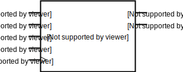
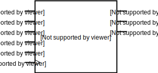
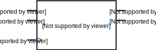
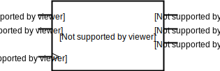

:tocdepth: 2

=====
State
=====

.. _DownCounterMod4:

DownCounterMod4
===============

Class ``bw.state.DownCounterMod4``
------------------------------------



Defined in `bitwise/state/COUNT.py <https://github.com/jamesjiang52/Bitwise/blob/master/bitwise/state/COUNT.py>`_.

2-bit (mod-4) down `counter <https://en.wikipedia.org/wiki/Counter_(digital)>`_ with parallel load.

__init__
--------

::

    __init__(
        enable,
        load_n,
        load_1,
        load_2,
        clock,
        output_1,
        output_2
    )

Construct a new mod-4 down counter.

Args:
~~~~~
* ``enable``: An object of type ``Wire``. Enables the counter.
* ``load_n``: An object of type ``Wire``. Loads ``load_1`` into ``output_1`` and ``load_2`` into ``output_2`` if its value is 0.
* ``load_1``: An object of type ``Wire``. The most significant bit of the load input.
* ``load_2``: An object of type ``Wire``. The least significant bit of the load input.
* ``clock``: An object of type ``Wire`` or ``Clock``. The clock input to the counter.
* ``output_1``: An object of type ``Wire``. The most significant bit of the output.
* ``output_2``: An object of type ``Wire``. The least significant bit of the output.

.. highlight:: none

__str__
-------

Print out the wire values of the mod-4 down counter. 

::

    enable: 0
    load_n: 0
    load_1: 0
    load_2: 0
    clock: 0
    output_1: 0
    output_2: 0

.. highlight:: python3
    
__call__
--------

::

    __call__(
        enable=None,
        load_n=None,
        load_1=None,
        load_2=None,
        clock=None,
        output_1=None,
        output_2=None
    )
    
Force specific values on the wires of the mod-4 down counter.

Note that this method takes `zero` positional arguments; all values must be given as keyword arguments.


.. _DownCounterMod8:

DownCounterMod8
===============

Class ``bw.state.DownCounterMod8``
------------------------------------



Defined in `bitwise/state/COUNT.py <https://github.com/jamesjiang52/Bitwise/blob/master/bitwise/state/COUNT.py>`_.

3-bit (mod-8) down `counter <https://en.wikipedia.org/wiki/Counter_(digital)>`_ with parallel load.

__init__
--------

::

    __init__(
        enable,
        load_n,
        load_1,
        load_2,
        load_3,
        clock,
        output_1,
        output_2,
        output_3
    )

Construct a new mod-8 down counter.

Args:
~~~~~
* ``enable``: An object of type ``Wire``. Enables the counter.
* ``load_n``: An object of type ``Wire``. Loads ``load_1`` into ``output_1``, ``load_2`` into ``output_2``, and ``load_3`` into ``output_3`` if its value is 0.
* ``load_1``: An object of type ``Wire``. The most significant bit of the load input.
* ``load_2``: An object of type ``Wire``.
* ``load_3``: An object of type ``Wire``. The least significant bit of the load input.
* ``clock``: An object of type ``Wire`` or ``Clock``. The clock input to the counter.
* ``output_1``: An object of type ``Wire``. The most significant bit of the output.
* ``output_2``: An object of type ``Wire``.
* ``output_3``: An object of type ``Wire``. The least significant bit of the output.

.. highlight:: none

__str__
-------

Print out the wire values of the mod-8 down counter. 

::

    enable: 0
    load_n: 0
    load_1: 0
    load_2: 0
    load_3: 0
    clock: 0
    output_1: 0
    output_2: 0
    output_3: 0

.. highlight:: python3
    
__call__
--------

::

    __call__(
        enable=None,
        load_n=None,
        load_1=None,
        load_2=None,
        load_3=None,
        clock=None,
        output_1=None,
        output_2=None,
        output_3=None
    )
    
Force specific values on the wires of the mod-8 down counter.

Note that this method takes `zero` positional arguments; all values must be given as keyword arguments.


.. _DownCounterMod16:

DownCounterMod16
================

Class ``bw.state.DownCounterMod16``
-------------------------------------

.. image:: images/schematics/state/DownCounterMod16.svg
    :width: 800px

Defined in `bitwise/state/COUNT.py <https://github.com/jamesjiang52/Bitwise/blob/master/bitwise/state/COUNT.py>`_.

4-bit (mod-16) down `counter <https://en.wikipedia.org/wiki/Counter_(digital)>`_ with parallel load.

__init__
--------

::

    __init__(
        enable,
        load_n,
        load_bus,
        clock,
        output_bus
    )

Construct a new mod-16 down counter.

Args:
~~~~~
* ``enable``: An object of type ``Wire``. Enables the counter.
* ``load_n``: An object of type ``Wire``. Loads ``load_bus`` into ``output_bus`` if its value is 0.
* ``load_bus``: An object of type ``Bus4``. The load input to the counter. ``load_bus[0]`` and ``load_bus[3]`` are the most and least significant bit, respectively.
* ``clock``: An object of type ``Wire`` or ``Clock``. The clock input to the counter.
* ``output_bus``: An object of type ``Bus4``. The output of the counter. ``output_bus[0]`` and ``output_bus[3]`` are the most and least significant bit, respectively.

Raises:
~~~~~~~
* ``TypeError``: If either ``load_bus`` or ``output_bus`` is not a bus of width 4.

.. highlight:: none

__str__
-------

Print out the wire values of the mod-16 down counter. 

::

    enable: 0
    load_n: 0
    load_bus: (0, 0, 0, 0)
    clock: 0
    output_bus: (0, 0, 0, 0)

.. highlight:: python3
    
__call__
--------

::

    __call__(
        enable=None,
        load_n=None,
        load_bus=None,
        clock=None,
        output_bus=None
    )
    
Force specific values on the wires of the mod-16 down counter.

Note that this method takes `zero` positional arguments; all values must be given as keyword arguments.


.. _ParallelToSerialConverter4To1:

ParallelToSerialConverter4To1
=============================

Class ``bw.state.ParallelToSerialConverter4To1``
-------------------------------------------------

.. image:: images/schematics/state/ParallelToSerialConverter4To1.svg
    :width: 600px

Defined in `bitwise/state/PISO.py <https://github.com/jamesjiang52/Bitwise/blob/master/bitwise/state/PISO.py>`_.

`4-bit-parallel-to-serial converter <https://en.wikipedia.org/wiki/Shift_register#Parallel-in_serial-out_(PISO)>`_.

__init__
--------

::

    __init__(
        enable,
        clear_n,
        load_n,
        data_bus,
        clock,
        output
    )

Construct a new 4-bit-parallel-to-serial converter.

Args:
~~~~~
* ``enable``: An object of type ``Wire``. Enables the converter.
* ``clear_n``: An object of type ``Wire``. Clears all 4 internal registers to 0 asynchronously if its value is 0.
* ``load_n``: An object of type ``Wire``. The mode select. A value of 0 indicates a parallel load operation, where the values of ``data_bus`` are loaded into the internal registers. A value of 1 indicates a shift-right operation.
* ``data_bus``: An object of type ``Bus4``. The parallel data input.
* ``clock``: An object of type ``Wire`` or ``Clock``. The clock input.
* ``output``: An object of type ``Wire``. The serial output of the converter. ``data_bus[3]`` is outputted first, and ``data_bus[0]`` is outputted last.

Raises:
~~~~~~~
* ``TypeError``: If ``data_bus`` is not a bus of width 4.

.. highlight:: none

__str__
-------

Print out the wire values of the 4-bit-parallel-to-serial converter. 

::

    enable: 0
    clear_n: 0
    load_n: 0
    data_bus: (0, 0, 0, 0)
    clock: 0
    output: 0

.. highlight:: python3
    
__call__
--------

::

    __call__(
        enable=None,
        clear_n=None,
        load_n=None,
        data_bus=None,
        clock=None,
        output=None
    )
    
Force specific values on the wires of the 4-bit-parallel-to-serial converter.

Note that this method takes `zero` positional arguments; all values must be given as keyword arguments.


.. _ParallelToSerialConverter8To1:

ParallelToSerialConverter8To1
=============================

Class ``bw.state.ParallelToSerialConverter8To1``
-------------------------------------------------


Defined in `bitwise/state/PISO.py <https://github.com/jamesjiang52/Bitwise/blob/master/bitwise/state/PISO.py>`_.

`8-bit-parallel-to-serial converter <https://en.wikipedia.org/wiki/Shift_register#Parallel-in_serial-out_(PISO)>`_.

__init__
--------

::

    __init__(
        enable,
        clear_n,
        load_n,
        data_bus,
        clock,
        output
    )

Construct a new 8-bit-parallel-to-serial converter.

Args:
~~~~~
* ``enable``: An object of type ``Wire``. Enables the converter.
* ``clear_n``: An object of type ``Wire``. Clears all 8 internal registers to 0 asynchronously if its value is 0.
* ``load_n``: An object of type ``Wire``. The mode select. A value of 0 indicates a parallel load operation, where the values of ``data_bus`` are loaded into the internal registers. A value of 1 indicates a shift-right operation.
* ``data_bus``: An object of type ``Bus8``. The parallel data input.
* ``clock``: An object of type ``Wire`` or ``Clock``. The clock input.
* ``output``: An object of type ``Wire``. The serial output of the converter. ``data_bus[7]`` is outputted first, and ``data_bus[0]`` is outputted last.

Raises:
~~~~~~~
* ``TypeError``: If ``data_bus`` is not a bus of width 8.

.. highlight:: none

__str__
-------

Print out the wire values of the 8-bit-parallel-to-serial converter. 

::

    enable: 0
    clear_n: 0
    load_n: 0
    data_bus: (0, 0, 0, 0, 0, 0, 0, 0)
    clock: 0
    output: 0

.. highlight:: python3
    
__call__
--------

::

    __call__(
        enable=None,
        clear_n=None,
        load_n=None,
        data_bus=None,
        clock=None,
        output=None
    )
    
Force specific values on the wires of the 8-bit-parallel-to-serial converter.

Note that this method takes `zero` positional arguments; all values must be given as keyword arguments.


.. _ParallelToSerialConverter16To1:

ParallelToSerialConverter16To1
==============================

Class ``bw.state.ParallelToSerialConverter16To1``
--------------------------------------------------


Defined in `bitwise/state/PISO.py <https://github.com/jamesjiang52/Bitwise/blob/master/bitwise/state/PISO.py>`_.

`16-bit-parallel-to-serial converter <https://en.wikipedia.org/wiki/Shift_register#Parallel-in_serial-out_(PISO)>`_.

__init__
--------

::

    __init__(
        enable,
        clear_n,
        load_n,
        data_bus,
        clock,
        output
    )

Construct a new 16-bit-parallel-to-serial converter.

Args:
~~~~~
* ``enable``: An object of type ``Wire``. Enables the converter.
* ``clear_n``: An object of type ``Wire``. Clears all 16 internal registers to 0 asynchronously if its value is 0.
* ``load_n``: An object of type ``Wire``. The mode select. A value of 0 indicates a parallel load operation, where the values of ``data_bus`` are loaded into the internal registers. A value of 1 indicates a shift-right operation.
* ``data_bus``: An object of type ``Bus16``. The parallel data input.
* ``clock``: An object of type ``Wire`` or ``Clock``. The clock input.
* ``output``: An object of type ``Wire``. The serial output of the converter. ``data_bus[15]`` is outputted first, and ``data_bus[0]`` is outputted last.

Raises:
~~~~~~~
* ``TypeError``: If ``data_bus`` is not a bus of width 16.

.. highlight:: none

__str__
-------

Print out the wire values of the 16-bit-parallel-to-serial converter. 

::

    enable: 0
    clear_n: 0
    load_n: 0
    data_bus: (0, 0, 0, 0, 0, 0, 0, 0, 0, 0, 0, 0, 0, 0, 0, 0)
    clock: 0
    output: 0

.. highlight:: python3
    
__call__
--------

::

    __call__(
        enable=None,
        clear_n=None,
        load_n=None,
        data_bus=None,
        clock=None,
        output=None
    )
    
Force specific values on the wires of the 16-bit-parallel-to-serial converter.

Note that this method takes `zero` positional arguments; all values must be given as keyword arguments.


.. _RingCounter4:

RingCounter4
============

Class ``bw.state.RingCounter4``
-------------------------------


Defined in `bitwise/state/RING.py <https://github.com/jamesjiang52/Bitwise/blob/master/bitwise/state/RING.py>`_.

4-bit straight `ring counter <https://en.wikipedia.org/wiki/Ring_counter>`_.

__init__
--------

::

    __init__(
        enable,
        clear_n,
        clock,
        output_bus
    )

Construct a new 4-bit ring counter.

Args:
~~~~~
* ``enable``: An object of type ``Wire``. Enables the ring counter.
* ``clear_n``: An object of type ``Wire``. Clears ``output_bus`` to (0, 0, 0, 1) (the 0 state) asynchronously if its value is 0.
* ``clock``: An object of type ``Wire`` or ``Clock``. The clock input.
* ``output_bus``: An object of type ``Bus4``. The one-hot output of the ring counter. Starts at (0, 0, 0, 1) and counts up to (1, 0, 0, 0).

Raises:
~~~~~~~
* ``TypeError``: If ``output_bus`` is not a bus of width 4.

.. highlight:: none

__str__
-------

Print out the wire values of the 4-bit ring counter. 

::

    enable: 0
    clear_n: 0
    clock: 0
    output_bus: (0, 0, 0, 0)

.. highlight:: python3
    
__call__
--------

::

    __call__(
        enable=None,
        clear_n=None,
        clock=None,
        output_bus=None
    )
    
Force specific values on the wires of the 4-bit ring counter.

Note that this method takes `zero` positional arguments; all values must be given as keyword arguments.


.. _RingCounter8:

RingCounter8
============

Class ``bw.state.RingCounter8``
-------------------------------


Defined in `bitwise/state/RING.py <https://github.com/jamesjiang52/Bitwise/blob/master/bitwise/state/RING.py>`_.

8-bit straight `ring counter <https://en.wikipedia.org/wiki/Ring_counter>`_.

__init__
--------

::

    __init__(
        enable,
        clear_n,
        clock,
        output_bus
    )

Construct a new 8-bit ring counter.

Args:
~~~~~
* ``enable``: An object of type ``Wire``. Enables the ring counter.
* ``clear_n``: An object of type ``Wire``. Clears ``output_bus`` to (0, 0, 0, 0, 0, 0, 0, 1) (the 0 state) asynchronously if its value is 0.
* ``clock``: An object of type ``Wire`` or ``Clock``. The clock input.
* ``output_bus``: An object of type ``Bus8``. The one-hot output of the ring counter. Starts at (0, 0, 0, 0, 0, 0, 0, 1) and counts up to (1, 0, 0, 0, 0, 0, 0, 0).

Raises:
~~~~~~~
* ``TypeError``: If ``output_bus`` is not a bus of width 8.

.. highlight:: none

__str__
-------

Print out the wire values of the 8-bit ring counter. 

::

    enable: 0
    clear_n: 0
    clock: 0
    output_bus: (0, 0, 0, 0, 0, 0, 0, 0)

.. highlight:: python3
    
__call__
--------

::

    __call__(
        enable=None,
        clear_n=None,
        clock=None,
        output_bus=None
    )
    
Force specific values on the wires of the 8-bit ring counter.

Note that this method takes `zero` positional arguments; all values must be given as keyword arguments.


.. _RingCounter16:

RingCounter16
=============

Class ``bw.state.RingCounter16``
--------------------------------

.. image:: images/schematics/state/RingCounter16.svg
    :width: 600px

Defined in `bitwise/state/RING.py <https://github.com/jamesjiang52/Bitwise/blob/master/bitwise/state/RING.py>`_.

16-bit straight `ring counter <https://en.wikipedia.org/wiki/Ring_counter>`_.

__init__
--------

::

    __init__(
        enable,
        clear_n,
        clock,
        output_bus
    )

Construct a new 16-bit ring counter.

Args:
~~~~~
* ``enable``: An object of type ``Wire``. Enables the ring counter.
* ``clear_n``: An object of type ``Wire``. Clears ``output_bus`` to (0, 0, 0, 0, 0, 0, 0, 0, 0, 0, 0, 0, 0, 0, 0, 1) (the 0 state) asynchronously if its value is 0.
* ``clock``: An object of type ``Wire`` or ``Clock``. The clock input.
* ``output_bus``: An object of type ``Bus16``. The one-hot output of the ring counter. Starts at (0, 0, 0, 0, 0, 0, 0, 0, 0, 0, 0, 0, 0, 0, 0, 1) and counts up to (1, 0, 0, 0, 0, 0, 0, 0, 0, 0, 0, 0, 0, 0, 0, 0).

Raises:
~~~~~~~
* ``TypeError``: If ``output_bus`` is not a bus of width 16.

.. highlight:: none

__str__
-------

Print out the wire values of the 16-bit ring counter. 

::

    enable: 0
    clear_n: 0
    clock: 0
    output_bus: (0, 0, 0, 0, 0, 0, 0, 0, 0, 0, 0, 0, 0, 0, 0, 0)

.. highlight:: python3
    
__call__
--------

::

    __call__(
        enable=None,
        clear_n=None,
        clock=None,
        output_bus=None
    )
    
Force specific values on the wires of the 16-bit ring counter.

Note that this method takes `zero` positional arguments; all values must be given as keyword arguments.


.. _SerialToParallelConverter1To4:

SerialToParallelConverter1To4
=============================

Class ``bw.state.SerialToParallelConverter1To4``
--------------------------------------------------


Defined in `bitwise/state/SIPO.py <https://github.com/jamesjiang52/Bitwise/blob/master/bitwise/state/SIPO.py>`_.

`Serial-to-4-bit-parallel converter <https://en.wikipedia.org/wiki/Shift_register#Serial-in_parallel-out_(SIPO)>`_.

__init__
--------

::

    __init__(
        enable,
        clear_n,
        data,
        clock,
        output_bus
    )

Construct a new serial-to-4-bit-parallel converter.

Args:
~~~~~
* ``enable``: An object of type ``Wire``. Enables the converter.
* ``clear_n``: An object of type ``Wire``. Clears all 4 internal registers to 0 asynchronously if its value is 0.
* ``data``: An object of type ``Wire``. The serial data input.
* ``clock``: An object of type ``Wire`` or ``Clock``. The clock input.
* ``output_bus``: An object of type ``Bus4``. The parallel output of the converter. ``output[0]`` corresponds to the most recent serial data input.

Raises:
~~~~~~~
* ``TypeError``: If ``output_bus`` is not a bus of width 4.

.. highlight:: none

__str__
-------

Print out the wire values of the serial-to-4-bit-parallel converter. 

::

    enable: 0
    clear_n: 0
    data: 0
    clock: 0
    output_bus: (0, 0, 0, 0)

.. highlight:: python3
    
__call__
--------

::

    __call__(
        enable=None,
        clear_n=None,
        data=None,
        clock=None,
        output_bus=None
    )
    
Force specific values on the wires of the serial-to-4-bit-parallel converter.

Note that this method takes `zero` positional arguments; all values must be given as keyword arguments.


.. _SerialToParallelConverter1To8:

SerialToParallelConverter1To8
=============================

Class ``bw.state.SerialToParallelConverter1To8``
--------------------------------------------------


Defined in `bitwise/state/SIPO.py <https://github.com/jamesjiang52/Bitwise/blob/master/bitwise/state/SIPO.py>`_.

`Serial-to-8-bit-parallel converter <https://en.wikipedia.org/wiki/Shift_register#Serial-in_parallel-out_(SIPO)>`_.

__init__
--------

::

    __init__(
        enable,
        clear_n,
        data,
        clock,
        output_bus
    )

Construct a new serial-to-8-bit-parallel converter.

Args:
~~~~~
* ``enable``: An object of type ``Wire``. Enables the converter.
* ``clear_n``: An object of type ``Wire``. Clears all 8 internal registers to 0 asynchronously if its value is 0.
* ``data``: An object of type ``Wire``. The serial data input.
* ``clock``: An object of type ``Wire`` or ``Clock``. The clock input.
* ``output_bus``: An object of type ``Bus8``. The parallel output of the converter. ``output[0]`` corresponds to the most recent serial data input.

Raises:
~~~~~~~
* ``TypeError``: If ``output_bus`` is not a bus of width 8.

.. highlight:: none

__str__
-------

Print out the wire values of the serial-to-8-bit-parallel converter. 

::

    enable: 0
    clear_n: 0
    data: 0
    clock: 0
    output_bus: (0, 0, 0, 0, 0, 0, 0, 0)

.. highlight:: python3
    
__call__
--------

::

    __call__(
        enable=None,
        clear_n=None,
        data=None,
        clock=None,
        output_bus=None
    )
    
Force specific values on the wires of the serial-to-8-bit-parallel converter.

Note that this method takes `zero` positional arguments; all values must be given as keyword arguments.


.. _SerialToParallelConverter1To16:

SerialToParallelConverter1To16
==============================

Class ``bw.state.SerialToParallelConverter1To16``
---------------------------------------------------


Defined in `bitwise/state/SIPO.py <https://github.com/jamesjiang52/Bitwise/blob/master/bitwise/state/SIPO.py>`_.

`Serial-to-16-bit-parallel converter <https://en.wikipedia.org/wiki/Shift_register#Serial-in_parallel-out_(SIPO)>`_.

__init__
--------

::

    __init__(
        enable,
        clear_n,
        data,
        clock,
        output_bus
    )

Construct a new serial-to-16-bit-parallel converter.

Args:
~~~~~
* ``enable``: An object of type ``Wire``. Enables the converter.
* ``clear_n``: An object of type ``Wire``. Clears all 16 internal registers to 0 asynchronously if its value is 0.
* ``data``: An object of type ``Wire``. The serial data input.
* ``clock``: An object of type ``Wire`` or ``Clock``. The clock input.
* ``output_bus``: An object of type ``Bus16``. The parallel output of the converter. ``output[0]`` corresponds to the most recent serial data input.

Raises:
~~~~~~~
* ``TypeError``: If ``output_bus`` is not a bus of width 16.

.. highlight:: none

__str__
-------

Print out the wire values of the serial-to-16-bit-parallel converter. 

::

    enable: 0
    clear_n: 0
    data: 0
    clock: 0
    output_bus: (0, 0, 0, 0, 0, 0, 0, 0, 0, 0, 0, 0, 0, 0, 0, 0)

.. highlight:: python3
    
__call__
--------

::

    __call__(
        enable=None,
        clear_n=None,
        data=None,
        clock=None,
        output_bus=None
    )
    
Force specific values on the wires of the serial-to-16-bit-parallel converter.

Note that this method takes `zero` positional arguments; all values must be given as keyword arguments.


.. _ShiftRegister4:

ShiftRegister4
==============

Class ``bw.state.ShiftRegister4``
-----------------------------------


Defined in `bitwise/state/SHIFT.py <https://github.com/jamesjiang52/Bitwise/blob/master/bitwise/state/SHIFT.py>`_.

`4-bit shift register <https://en.wikipedia.org/wiki/Shift_register>`_.

__init__
--------

::

    __init__(
        enable,
        clear_n,
        shift_load,
        data_bus,
        data_serial,
        clock,
        output_bus,
        output_serial
    )

Construct a new 4-bit shift register.

Args:
~~~~~
* ``enable``: An object of type ``Wire``. Enables the shift register.
* ``clear_n``: An object of type ``Wire``. Clears ``output_bus`` and ``output_serial`` to 0 asynchronously if its value is 0.
* ``shift_load``: An object of type ``Wire``. The mode select. A value of 0 indicates a parallel load operation, where ``output_bus`` takes on the value of ``data_bus``. A value of 1 indicates a shift-right operation, where ``output_bus[3]`` takes on the value of ``output_bus[2]``, ``output_bus[2]`` takes on the value of ``output_bus[1]``, and so on; ``output_bus[0]`` takes on the value of ``data_serial``.
* ``data_bus``: An object of type ``Bus4``. The parallel data input.
* ``data_serial``. An object of type ``Wire``. The serial data input.
* ``clock``. An object of type ``Wire`` or ``Clock``. The clock input to the shift register.
* ``output_bus``. An object of type ``Bus4``. The parallel data output.
* ``output_serial``. An object of type ``Wire``. The serial data output. Identical to ``output_bus[3]``.

Raises:
~~~~~~~
* ``TypeError``: If either ``data_bus`` or ``output_bus`` is not a bus of width 4.

.. highlight:: none

__str__
-------

Print out the wire values of the 4-bit shift register. 

::

    enable: 0
    clear_n: 0
    shift_load: 0
    data_bus: (0, 0, 0, 0)
    data_serial: 0
    clock: 0
    output_bus: (0, 0, 0, 0)
    output_serial: 0

.. highlight:: python3
    
__call__
--------

::

    __call__(
        enable=None,
        clear_n=None,
        shift_load=None,
        data_bus=None,
        data_serial=None,
        clock=None,
        output_bus=None,
        output_serial=None
    )
    
Force specific values on the wires of the 4-bit shift register.

Note that this method takes `zero` positional arguments; all values must be given as keyword arguments.


.. _ShiftRegister8:

ShiftRegister8
==============

Class ``bw.state.ShiftRegister8``
-----------------------------------

.. image:: images/schematics/state/ShiftRegister8.svg
    :width: 800px

Defined in `bitwise/state/SHIFT.py <https://github.com/jamesjiang52/Bitwise/blob/master/bitwise/state/SHIFT.py>`_.

`8-bit shift register <https://en.wikipedia.org/wiki/Shift_register>`_.

__init__
--------

::

    __init__(
        enable,
        clear_n,
        shift_load,
        data_bus,
        data_serial,
        clock,
        output_bus,
        output_serial
    )

Construct a new 8-bit shift register.

Args:
~~~~~
* ``enable``: An object of type ``Wire``. Enables the shift register.
* ``clear_n``: An object of type ``Wire``. Clears ``output_bus`` and ``output_serial`` to 0 asynchronously if its value is 0.
* ``shift_load``: An object of type ``Wire``. The mode select. A value of 0 indicates a parallel load operation, where ``output_bus`` takes on the value of ``data_bus``. A value of 1 indicates a shift-right operation, where ``output_bus[7]`` takes on the value of ``output_bus[6]``, ``output_bus[6]`` takes on the value of ``output_bus[5]``, and so on; ``output_bus[0]`` takes on the value of ``data_serial``.
* ``data_bus``: An object of type ``Bus8``. The parallel data input.
* ``data_serial``. An object of type ``Wire``. The serial data input.
* ``clock``. An object of type ``Wire`` or ``Clock``. The clock input to the shift register.
* ``output_bus``. An object of type ``Bus8``. The parallel data output.
* ``output_serial``. An object of type ``Wire``. The serial data output. Identical to ``output_bus[7]``.

Raises:
~~~~~~~
* ``TypeError``: If either ``data_bus`` or ``output_bus`` is not a bus of width 8.

.. highlight:: none

__str__
-------

Print out the wire values of the 8-bit shift register. 

::

    enable: 0
    clear_n: 0
    shift_load: 0
    data_bus: (0, 0, 0, 0, 0, 0, 0, 0)
    data_serial: 0
    clock: 0
    output_bus: (0, 0, 0, 0, 0, 0, 0, 0)
    output_serial: 0

.. highlight:: python3
    
__call__
--------

::

    __call__(
        enable=None,
        clear_n=None,
        shift_load=None,
        data_bus=None,
        data_serial=None,
        clock=None,
        output_bus=None,
        output_serial=None
    )
    
Force specific values on the wires of the 8-bit shift register.

Note that this method takes `zero` positional arguments; all values must be given as keyword arguments.


.. _ShiftRegister16:

ShiftRegister16
===============

Class ``bw.state.ShiftRegister16``
------------------------------------


Defined in `bitwise/state/SHIFT.py <https://github.com/jamesjiang52/Bitwise/blob/master/bitwise/state/SHIFT.py>`_.

`16-bit shift register <https://en.wikipedia.org/wiki/Shift_register>`_.

__init__
--------

::

    __init__(
        enable,
        clear_n,
        shift_load,
        data_bus,
        data_serial,
        clock,
        output_bus,
        output_serial
    )

Construct a new 16-bit shift register.

Args:
~~~~~
* ``enable``: An object of type ``Wire``. Enables the shift register.
* ``clear_n``: An object of type ``Wire``. Clears ``output_bus`` and ``output_serial`` to 0 asynchronously if its value is 0.
* ``shift_load``: An object of type ``Wire``. The mode select. A value of 0 indicates a parallel load operation, where ``output_bus`` takes on the value of ``data_bus``. A value of 1 indicates a shift-right operation, where ``output_bus[15]`` takes on the value of ``output_bus[14]``, ``output_bus[14]`` takes on the value of ``output_bus[13]``, and so on; ``output_bus[0]`` takes on the value of ``data_serial``.
* ``data_bus``: An object of type ``Bus16``. The parallel data input.
* ``data_serial``. An object of type ``Wire``. The serial data input.
* ``clock``. An object of type ``Wire`` or ``Clock``. The clock input to the shift register.
* ``output_bus``. An object of type ``Bus16``. The parallel data output.
* ``output_serial``. An object of type ``Wire``. The serial data output. Identical to ``output_bus[15]``.

Raises:
~~~~~~~
* ``TypeError``: If either ``data_bus`` or ``output_bus`` is not a bus of width 16.

.. highlight:: none

__str__
-------

Print out the wire values of the 16-bit shift register. 

::

    enable: 0
    clear_n: 0
    shift_load: 0
    data_bus: (0, 0, 0, 0, 0, 0, 0, 0, 0, 0, 0, 0, 0, 0, 0, 0)
    data_serial: 0
    clock: 0
    output_bus: (0, 0, 0, 0, 0, 0, 0, 0, 0, 0, 0, 0, 0, 0, 0, 0)
    output_serial: 0

.. highlight:: python3
    
__call__
--------

::

    __call__(
        enable=None,
        clear_n=None,
        shift_load=None,
        data_bus=None,
        data_serial=None,
        clock=None,
        output_bus=None,
        output_serial=None
    )
    
Force specific values on the wires of the 16-bit shift register.

Note that this method takes `zero` positional arguments; all values must be given as keyword arguments.


.. _UpCounterMod4:

UpCounterMod4
=============

Class ``bw.state.UpCounterMod4``
----------------------------------



Defined in `bitwise/state/COUNT.py <https://github.com/jamesjiang52/Bitwise/blob/master/bitwise/state/COUNT.py>`_.

2-bit (mod-4) up `counter <https://en.wikipedia.org/wiki/Counter_(digital)>`_ with asynchronous clear.

__init__
--------

::

    __init__(
        enable, 
        clear_n, 
        clock,
        output_1, 
        output_2
    )

Construct a new mod-4 up counter.

Args:
~~~~~
* ``enable``: An object of type ``Wire``. Enables the counter.
* ``clear_n``: An object of type ``Wire``. Clears ``output_1`` and ``output_2`` to 0 asynchronously if its value is 0.
* ``clock``: An object of type ``Wire`` or ``Clock``. The clock input to the counter.
* ``output_1``: An object of type ``Wire``. The most significant bit of the output.
* ``output_2``: An object of type ``Wire``. The least significant bit of the output.

.. highlight:: none

__str__
-------

Print out the wire values of the mod-4 up counter. 

::

    enable: 0
    clear_n: 0
    clock: 0
    output_1: 0
    output_2: 0

.. highlight:: python3
    
__call__
--------

::

    __call__(
        enable=None,
        clear_n=None,
        clock=None,
        output_1=None,
        output_2=None
    )
    
Force specific values on the wires of the mod-4 up counter.

Note that this method takes `zero` positional arguments; all values must be given as keyword arguments.


.. _UpCounterMod8:

UpCounterMod8
=============

Class ``bw.state.UpCounterMod8``
----------------------------------



Defined in `bitwise/state/COUNT.py <https://github.com/jamesjiang52/Bitwise/blob/master/bitwise/state/COUNT.py>`_.

3-bit (mod-8) up `counter <https://en.wikipedia.org/wiki/Counter_(digital)>`_ with asynchronous clear.

__init__
--------

::

    __init__(
        enable, 
        clear_n, 
        clock, 
        output_1, 
        output_2, 
        output_3
    )

Construct a new mod-8 up counter.

Args:
~~~~~
* ``enable``: An object of type ``Wire``. Enables the counter.
* ``clear_n``: An object of type ``Wire``. Clears ``output_1``, ``output_2``, and ``output_3`` to 0 asynchronously if its value is 0.
* ``clock``: An object of type ``Wire`` or ``Clock``. The clock input to the counter.
* ``output_1``: An object of type ``Wire``. The most significant bit of the output.
* ``output_2``: An object of type ``Wire``.
* ``output_3``: An object of type ``Wire``. The least significant bit of the output.

.. highlight:: none

__str__
-------

Print out the wire values of the mod-8 up counter. 

::

    enable: 0
    clear_n: 0
    clock: 0
    output_1: 0
    output_2: 0
    output_3: 0

.. highlight:: python3
    
__call__
--------

::

    __call__(
        enable=None,
        clear_n=None,
        clock=None,
        output_1=None,
        output_2=None,
        output_3=None
    )
    
Force specific values on the wires of the mod-8 up counter.

Note that this method takes `zero` positional arguments; all values must be given as keyword arguments.


.. _UpCounterMod16:

UpCounterMod16
==============

Class ``bw.state.UpCounterMod16``
-----------------------------------


Defined in `bitwise/state/COUNT.py <https://github.com/jamesjiang52/Bitwise/blob/master/bitwise/state/COUNT.py>`_.

4-bit (mod-16) up `counter <https://en.wikipedia.org/wiki/Counter_(digital)>`_ with asynchronous clear.

__init__
--------

::

    __init__(
        enable, 
        clear_n, 
        clock, 
        output_bus
    )

Construct a new mod-16 up counter.

Args:
~~~~~
* ``enable``: An object of type ``Wire``. Enables the counter.
* ``clear_n``: An object of type ``Wire``. Clears ``output_bus`` to 0 asynchronously if its value is 0.
* ``clock``: An object of type ``Wire`` or ```Clock``. The clock input to the counter.
* ``output_bus``: An object of type ``Bus4``. The output of the counter. ``output_bus[0]`` and ``output_bus[3]`` are the most and least significant bit, respectively.

Raises:
~~~~~~~
* ``TypeError``: If ``output_bus`` is not a bus of width 4.

.. highlight:: none

__str__
-------

Print out the wire values of the mod-16 up counter. 

::

    enable: 0
    clear_n: 0
    clock: 0
    output_bus: (0, 0, 0, 0)

.. highlight:: python3
    
__call__
--------

::

    __call__(
        enable=None,
        clear_n=None,
        clock=None,
        output_bus=None
    )
    
Force specific values on the wires of the mod-16 up counter.

Note that this method takes `zero` positional arguments; all values must be given as keyword arguments.
