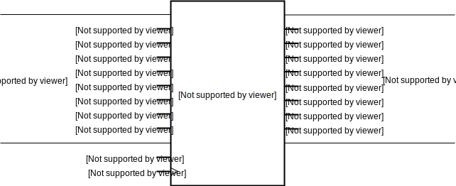

:tocdepth: 2

=======
Storage
=======

.. _DFlipFlop:

DFlipFlop
=========

Class ``bw.storage.DFlipFlop``
------------------------------

.. image:: images/schematics/storage/DFlipFlop.svg
    :width: 360px

Defined in `bitwise/storage/FLOP.py <https://github.com/jamesjiang52/Bitwise/blob/master/bitwise/storage/FLOP.py>`_.

Positive edge-triggered `D flip-flop <https://en.wikipedia.org/wiki/Flip-flop_(electronics)#D_flip-flop>`_.

__init__
--------

::

    __init__(
        data,
        clock,
        output,
        output_not
    )

Construct a new positive edge-triggered D flip-flop.

Args:
~~~~~
* ``data``: An object of type ``Wire``. The data input to the flip-flop.
* ``clock``: An object of type ``Wire`` or ``Clock``. The clock input to the flip-flop.
* ``output``: An object of type ``Wire``. The output of the flip-flop. Takes on the value of ``data`` on the positive edges of ``clock``.
* ``output_not``: An object of type ``Wire``. The complemented form of ``output``.

.. highlight:: none

__str__
-------

Print out the wire values of the D flip-flop. 

::

    data: 0
    clock: 0
    output: 0
    output_not: 0

.. highlight:: python3
    
__call__
--------

::

    __call__(
        data=None,
        clock=None,
        output=None,
        output_not=None
    )
    
Force specific values on the wires of the D flip-flop.

Note that this method takes `zero` positional arguments; all values must be given as keyword arguments.

.. _DFlipFlopPresetClear:

DFlipFlopPresetClear
====================

Class ``bw.storage.DFlipFlopPresetClear``
-----------------------------------------

Defined in `bitwise/storage/FLOP.py <https://github.com/jamesjiang52/Bitwise/blob/master/bitwise/storage/FLOP.py>`_.

Positive edge-triggered `D flip-flop <https://en.wikipedia.org/wiki/Flip-flop_(electronics)#D_flip-flop>`_ with asynchronous active low preset and clear.

__init__
--------

::

    __init__(
        data,
        preset_n,
        clear_n,
        clock,
        output,
        output_not
    )

Construct a new positive edge-triggered D flip-flop with preset/clear capabilities.

Args:
~~~~~
* ``data``: An object of type ``Wire``. The data input to the flip-flop.
* ``preset_n``: An object of type ``Wire``. Presets ``output`` to 1 and ``output_not`` to 0 asynchronously if its value is 0.
* ``clear_n``: An object of type ``Wire``. Clears ``output`` to 0 and ``output_not`` to 1 asynchronously if its value is 0.
* ``clock``: An object of type ``Wire`` or ``Clock``. The clock input to the flip-flop.
* ``output``: An object of type ``Wire``. The output of the flip-flop. Takes on the value of ``data`` on the positive edges of ``clock``.
* ``output_not``: An object of type ``Wire``. The complemented form of ``output``.

.. highlight:: none

__str__
-------

Print out the wire values of the D flip-flop with preset/clear capabilities. 

::

    data: 0
    preset_n: 0
    clear_n: 0
    clock: 0
    output: 0
    output_not: 0

.. highlight:: python3
    
__call__
--------

::

    __call__(
        data=None,
        preset_n=None,
        clear_n=None,
        clock=None,
        output=None,
        output_not=None
    )
    
Force specific values on the wires of the D flip-flop with preset/clear capabilities.

Note that this method takes `zero` positional arguments; all values must be given as keyword arguments.

.. _GatedDLatch:

GatedDLatch
===========

Class ``bw.storage.GatedDLatch``
--------------------------------

Defined in `bitwise/storage/FLOP.py <https://github.com/jamesjiang52/Bitwise/blob/master/bitwise/storage/FLOP.py>`_.

`Gated D latch <https://en.wikipedia.org/wiki/Flip-flop_(electronics)#Gated_D_latch>`_.

__init__
--------

::

    __init__(
        data,
        clock,
        output,
        output_not
    )

Construct a new gated D latch.

Args:
~~~~~
* ``data``: An object of type ``Wire``. The data input to the latch.
* ``clock``: An object of type ``Wire`` or ``Clock``. The clock input to the latch.
* ``output``: An object of type ``Wire``. The output of the latch. Takes on the value of ``data`` if the value of ``clock`` is 1.
* ``output_not``: An object of type ``Wire``. The complemented form of ``output``.

.. highlight:: none

__str__
-------

Print out the wire values of the gated D latch. 

::

    data: 0
    clock: 0
    output: 0
    output_not: 0

.. highlight:: python3
    
__call__
--------

::

    __call__(
        data=None,
        clock=None,
        output=None,
        output_not=None
    )
    
Force specific values on the wires of the gated D latch.

Note that this method takes `zero` positional arguments; all values must be given as keyword arguments.

.. _GatedSRLatch:

GatedSRLatch
============

Class ``bw.storage.GatedSRLatch``
---------------------------------

.. image:: images/schematics/storage/GatedSRLatch.svg
    :width: 360px

Defined in `bitwise/storage/FLOP.py <https://github.com/jamesjiang52/Bitwise/blob/master/bitwise/storage/FLOP.py>`_.

`Gated SR latch <https://en.wikipedia.org/wiki/Flip-flop_(electronics)#Gated_SR_latch>`_.

__init__
--------

::

    __init__(
        set,
        reset,
        clock,
        output,
        output_not
    )

Construct a new gated SR latch.

Args:
~~~~~
* ``set``: An object of type ``Wire``. The set input to the latch.
* ``reset``: An object of type ``Wire``. The reset input to the latch.
* ``clock``: An object of type ``Wire`` or ``Clock``. The clock input to the latch.
* ``output``: An object of type ``Wire``. The output of the latch. When the value of ``clock`` is 1, takes on the value of 1 if the value of ``set`` is 1 and the value of 0 if the value of ``reset`` is 1.
* ``output_not``: An object of type ``Wire``. The complemented form of ``output``.

.. highlight:: none

__str__
-------

Print out the wire values of the gated SR latch. 

::

    set: 0
    reset: 0
    clock: 0
    output: 0
    output_not: 0

.. highlight:: python3
    
__call__
--------

::

    __call__(
        set=None,
        reset=None,
        clock=None,
        output=None,
        output_not=None
    )
    
Force specific values on the wires of the gated SR latch.

Note that this method takes `zero` positional arguments; all values must be given as keyword arguments.

.. _JKFlipFlop:

JKFlipFlop
==========

Class ``bw.storage.JKFlipFlop``
-------------------------------

Defined in `bitwise/storage/FLOP.py <https://github.com/jamesjiang52/Bitwise/blob/master/bitwise/storage/FLOP.py>`_.

Positive edge-triggered `JK flip-flop <https://en.wikipedia.org/wiki/Flip-flop_(electronics)#JK_flip-flop>`_.

__init__
--------

::

    __init__(
        J,
        K,
        clock,
        output,
        output_not
    )

Construct a new positive edge-triggered JK flip-flop.

Args:
~~~~~
* ``J``: An object of type ``Wire``. The J input to the flip-flop.
* ``K``: An object of type ``Wire``. The K input to the flip-flop.
* ``clock``: An object of type ``Wire`` or ``Clock``. The clock input to the flip-flop.
* ``output``: An object of type ``Wire``. The output of the flip-flop. On the positive edges of ``clock``, takes on the value of 1 if the value of ``J`` is 1, takes on the value of 0 if the value of ``K`` is 1, and toggles its value if both ``J`` and ``K`` have value 1.
* ``output_not``: An object of type ``Wire``. The complemented form of ``output``.

.. highlight:: none

__str__
-------

Print out the wire values of the JK flip-flop. 

::

    J: 0
    K: 0
    clock: 0
    output: 0
    output_not: 0

.. highlight:: python3
    
__call__
--------

::

    __call__(
        J=None,
        K=None,
        clock=None,
        output=None,
        output_not=None
    )
    
Force specific values on the wires of the JK flip-flop.

Note that this method takes `zero` positional arguments; all values must be given as keyword arguments.

.. _JKFlipFlopPresetClear:

JKFlipFlopPresetClear
=====================

Class ``bw.storage.JKFlipFlopPresetClear``
------------------------------------------

.. image:: images/schematics/storage/JKFlipFlopPresetClear.svg
    :width: 360px

Defined in `bitwise/storage/FLOP.py <https://github.com/jamesjiang52/Bitwise/blob/master/bitwise/storage/FLOP.py>`_.

Positive edge-triggered `JK flip-flop <https://en.wikipedia.org/wiki/Flip-flop_(electronics)#JK_flip-flop>`_ with asynchronous active low preset and clear.

__init__
--------

::

    __init__(
        J,
        K,
        preset_n,
        clear_n,
        clock,
        output,
        output_not
    )

Construct a new positive edge-triggered JK flip-flop with preset/clear capabilities.

Args:
~~~~~
* ``J``: An object of type ``Wire``. The J input to the flip-flop.
* ``K``: An object of type ``Wire``. The K input to the flip-flop.
* ``preset_n``: An object of type ``Wire``. Presets ``output`` to 1 and ``output_not`` to 0 asynchronously if its value is 0.
* ``clear_n``: An object of type ``Wire``. Clears ``output`` to 0 and ``output_not`` to 1 asynchronously if its value is 0.
* ``clock``: An object of type ``Wire`` or ``Clock``. The clock input to the flip-flop.
* ``output``: An object of type ``Wire``. The output of the flip-flop. On the positive edges of ``clock``, takes on the value of 1 if the value of ``J`` is 1, takes on the value of 0 if the value of ``K`` is 1, and toggles its value if both ``J`` and ``K`` have value 1.
* ``output_not``: An object of type ``Wire``. The complemented form of ``output``.

.. highlight:: none

__str__
-------

Print out the wire values of the JK flip-flop with preset/clear capabilities. 

::

    J: 0
    K: 0
    preset_n: 0
    clear_n: 0
    clock: 0
    output: 0
    output_not: 0

.. highlight:: python3
    
__call__
--------

::

    __call__(
        J=None,
        K=None,
        preset_n=None,
        clear_n=None,
        clock=None,
        output=None,
        output_not=None
    )
    
Force specific values on the wires of the JK flip-flop with preset/clear capabilities.

Note that this method takes `zero` positional arguments; all values must be given as keyword arguments.

.. _RAM16x4:

RAM16x4
=======

Class ``bw.storage.RAM16x4``
----------------------------

.. image:: images/schematics/storage/RAM16x4.svg
    :width: 800px

Defined in `bitwise/storage/RAM.py <https://github.com/jamesjiang52/Bitwise/blob/master/bitwise/storage/RAM.py>`_.

16-word deep 4-bit wide `random access memory <https://en.wikipedia.org/wiki/Random-access_memory>`_.

__init__
--------

::

    __init__(
        data_bus, 
        address_bus, 
        write_enable, 
        clock, 
        output_bus
    )

Construct a new 16-word deep 4-bit wide random access memory array.

Args:
~~~~~
* ``data_bus``: An object of type ``Bus4``. The data input in write operations.
* ``address_bus``: An object of type ``Bus4``. The address from which data is read from and written to.
* ``write_enable``: An object of type ``Wire``. The write enable input. A value of 1 indicates a write operation, while a value of 0 indicates a read-only operation (the value on data_bus is ignored).
* ``clock``: An object of type ``Wire`` or ``Clock``. The clock input.
* ``output_bus``: An object of type ``Bus4``. The currently stored data in the at the address indicated by ``address_bus``.

Raises:
~~~~~~~
* ``TypeError``: If either ``data_bus``, ``address_bus``, or ``output_bus`` is not a bus of width 4.

.. highlight:: none

__str__
-------

Print out the wire values of the random access memory array. 

::

    data_bus: (0, 0, 0, 0)
    address_bus: (0, 0, 0, 0)
    write_enable: 0
    clock: 0
    output_bus: (0, 0, 0, 0)

.. highlight:: python3
    
__call__
--------

::

    __call__(
        data_bus=None, 
        address_bus=None, 
        write_enable=None, 
        clock=None, 
        output_bus=None
    )
    
Force specific values on the wires of the random access memory array.

Note that this method takes `zero` positional arguments; all values must be given as keyword arguments.

.. _RAM256x4:

RAM256x4
========

Class ``bw.storage.RAM256x4``
-----------------------------

Defined in `bitwise/storage/RAM.py <https://github.com/jamesjiang52/Bitwise/blob/master/bitwise/storage/RAM.py>`_.

256-word deep 4-bit wide `random access memory <https://en.wikipedia.org/wiki/Random-access_memory>`_.

__init__
--------

::

    __init__(
        data_bus, 
        address_bus, 
        write_enable, 
        clock, 
        output_bus
    )

Construct a new 256-word deep 4-bit wide random access memory array.

Args:
~~~~~
* ``data_bus``: An object of type ``Bus4``. The data input in write operations.
* ``address_bus``: An object of type ``Bus8``. The address from which data is read from and written to.
* ``write_enable``: An object of type ``Wire``. The write enable input. A value of 1 indicates a write operation, while a value of 0 indicates a read-only operation (the value on data_bus is ignored).
* ``clock``: An object of type ``Wire`` or ``Clock``. The clock input.
* ``output_bus``: An object of type ``Bus4``. The currently stored data in the at the address indicated by ``address_bus``.

Raises:
~~~~~~~
* ``TypeError``: If either ``data_bus`` or ``output_bus`` is not a bus of width 4, or if ``address_bus`` is not a bus of width 8.

.. highlight:: none

__str__
-------

Print out the wire values of the random access memory array. 

::

    data_bus: (0, 0, 0, 0)
    address_bus: (0, 0, 0, 0, 0, 0, 0, 0)
    write_enable: 0
    clock: 0
    output_bus: (0, 0, 0, 0)

.. highlight:: python3
    
__call__
--------

::

    __call__(
        data_bus=None, 
        address_bus=None, 
        write_enable=None, 
        clock=None, 
        output_bus=None
    )
    
Force specific values on the wires of the random access memory array.

Note that this method takes `zero` positional arguments; all values must be given as keyword arguments.

.. _RAM65536x4:

RAM65536x4
==========

Class ``bw.storage.RAM65536x4``
-------------------------------

.. image:: images/schematics/storage/RAM65536x4.svg
    :width: 800px

Defined in `bitwise/storage/RAM.py <https://github.com/jamesjiang52/Bitwise/blob/master/bitwise/storage/RAM.py>`_.

65536-word deep 4-bit wide `random access memory <https://en.wikipedia.org/wiki/Random-access_memory>`_.

__init__
--------

::

    __init__(
        data_bus, 
        address_bus, 
        write_enable, 
        clock, 
        output_bus
    )

Construct a new 65536-word deep 4-bit wide random access memory array.

Args:
~~~~~
* ``data_bus``: An object of type ``Bus4``. The data input in write operations.
* ``address_bus``: An object of type ``Bus16``. The address from which data is read from and written to.
* ``write_enable``: An object of type ``Wire``. The write enable input. A value of 1 indicates a write operation, while a value of 0 indicates a read-only operation (the value on data_bus is ignored).
* ``clock``: An object of type ``Wire`` or ``Clock``. The clock input.
* ``output_bus``: An object of type ``Bus4``. The currently stored data in the at the address indicated by ``address_bus``.

Raises:
~~~~~~~
* ``TypeError``: If either ``data_bus`` or ``output_bus`` is not a bus of width 4, or if ``address_bus`` is not a bus of width 16.

.. highlight:: none

__str__
-------

Print out the wire values of the random access memory array. 

::

    data_bus: (0, 0, 0, 0)
    address_bus: (0, 0, 0, 0, 0, 0, 0, 0, 0, 0, 0, 0, 0, 0, 0, 0)
    write_enable: 0
    clock: 0
    output_bus: (0, 0, 0, 0)

.. highlight:: python3
    
__call__
--------

::

    __call__(
        data_bus=None, 
        address_bus=None, 
        write_enable=None, 
        clock=None, 
        output_bus=None
    )
    
Force specific values on the wires of the random access memory array.

Note that this method takes `zero` positional arguments; all values must be given as keyword arguments.

.. _RAM16x8:

RAM16x8
=======

Class ``bw.storage.RAM16x8``
----------------------------

.. image:: images/schematics/storage/RAM16x8.svg
    :width: 800px

Defined in `bitwise/storage/RAM.py <https://github.com/jamesjiang52/Bitwise/blob/master/bitwise/storage/RAM.py>`_.

16-word deep 8-bit wide `random access memory <https://en.wikipedia.org/wiki/Random-access_memory>`_.

__init__
--------

::

    __init__(
        data_bus, 
        address_bus, 
        write_enable, 
        clock, 
        output_bus
    )

Construct a new 16-word deep 8-bit wide random access memory array.

Args:
~~~~~
* ``data_bus``: An object of type ``Bus8``. The data input in write operations.
* ``address_bus``: An object of type ``Bus4``. The address from which data is read from and written to.
* ``write_enable``: An object of type ``Wire``. The write enable input. A value of 1 indicates a write operation, while a value of 0 indicates a read-only operation (the value on data_bus is ignored).
* ``clock``: An object of type ``Wire`` or ``Clock``. The clock input.
* ``output_bus``: An object of type ``Bus8``. The currently stored data in the at the address indicated by ``address_bus``.

Raises:
~~~~~~~
* ``TypeError``: If either ``data_bus`` or ``output_bus`` is not a bus of width 8, or if ``address_bus`` is not a bus of width 4.

.. highlight:: none

__str__
-------

Print out the wire values of the random access memory array. 

::

    data_bus: (0, 0, 0, 0, 0, 0, 0, 0)
    address_bus: (0, 0, 0, 0)
    write_enable: 0
    clock: 0
    output_bus: (0, 0, 0, 0, 0, 0, 0, 0)

.. highlight:: python3
    
__call__
--------

::

    __call__(
        data_bus=None, 
        address_bus=None, 
        write_enable=None, 
        clock=None, 
        output_bus=None
    )
    
Force specific values on the wires of the random access memory array.

Note that this method takes `zero` positional arguments; all values must be given as keyword arguments.

.. _RAM256x8:

RAM256x8
========

Class ``bw.storage.RAM256x8``
-----------------------------

Defined in `bitwise/storage/RAM.py <https://github.com/jamesjiang52/Bitwise/blob/master/bitwise/storage/RAM.py>`_.

256-word deep 8-bit wide `random access memory <https://en.wikipedia.org/wiki/Random-access_memory>`_.

__init__
--------

::

    __init__(
        data_bus, 
        address_bus, 
        write_enable, 
        clock, 
        output_bus
    )

Construct a new 256-word deep 8-bit wide random access memory array.

Args:
~~~~~
* ``data_bus``: An object of type ``Bus8``. The data input in write operations.
* ``address_bus``: An object of type ``Bus8``. The address from which data is read from and written to.
* ``write_enable``: An object of type ``Wire``. The write enable input. A value of 1 indicates a write operation, while a value of 0 indicates a read-only operation (the value on data_bus is ignored).
* ``clock``: An object of type ``Wire`` or ``Clock``. The clock input.
* ``output_bus``: An object of type ``Bus8``. The currently stored data in the at the address indicated by ``address_bus``.

Raises:
~~~~~~~
* ``TypeError``: If either ``data_bus``, ``address_bus``, or ``output_bus`` is not a bus of width 8.

.. highlight:: none

__str__
-------

Print out the wire values of the random access memory array. 

::

    data_bus: (0, 0, 0, 0, 0, 0, 0, 0)
    address_bus: (0, 0, 0, 0, 0, 0, 0, 0)
    write_enable: 0
    clock: 0
    output_bus: (0, 0, 0, 0, 0, 0, 0, 0)

.. highlight:: python3
    
__call__
--------

::

    __call__(
        data_bus=None, 
        address_bus=None, 
        write_enable=None, 
        clock=None, 
        output_bus=None
    )
    
Force specific values on the wires of the random access memory array.

Note that this method takes `zero` positional arguments; all values must be given as keyword arguments.

.. _RAM65536x8:

RAM65536x8
==========

Class ``bw.storage.RAM65536x8``
-------------------------------

.. image:: images/schematics/storage/RAM65536x8.svg
    :width: 800px

Defined in `bitwise/storage/RAM.py <https://github.com/jamesjiang52/Bitwise/blob/master/bitwise/storage/RAM.py>`_.

65536-word deep 8-bit wide `random access memory <https://en.wikipedia.org/wiki/Random-access_memory>`_.

__init__
--------

::

    __init__(
        data_bus, 
        address_bus, 
        write_enable, 
        clock, 
        output_bus
    )

Construct a new 65536-word deep 8-bit wide random access memory array.

Args:
~~~~~
* ``data_bus``: An object of type ``Bus8``. The data input in write operations.
* ``address_bus``: An object of type ``Bus16``. The address from which data is read from and written to.
* ``write_enable``: An object of type ``Wire``. The write enable input. A value of 1 indicates a write operation, while a value of 0 indicates a read-only operation (the value on data_bus is ignored).
* ``clock``: An object of type ``Wire`` or ``Clock``. The clock input.
* ``output_bus``: An object of type ``Bus8``. The currently stored data in the at the address indicated by ``address_bus``.

Raises:
~~~~~~~
* ``TypeError``: If either ``data_bus`` or ``output_bus`` is not a bus of width 8, or if ``address_bus`` is not a bus of width 16.

.. highlight:: none

__str__
-------

Print out the wire values of the random access memory array. 

::

    data_bus: (0, 0, 0, 0, 0, 0, 0, 0)
    address_bus: (0, 0, 0, 0, 0, 0, 0, 0, 0, 0, 0, 0, 0, 0, 0, 0)
    write_enable: 0
    clock: 0
    output_bus: (0, 0, 0, 0, 0, 0, 0, 0)

.. highlight:: python3
    
__call__
--------

::

    __call__(
        data_bus=None, 
        address_bus=None, 
        write_enable=None, 
        clock=None, 
        output_bus=None
    )
    
Force specific values on the wires of the random access memory array.

Note that this method takes `zero` positional arguments; all values must be given as keyword arguments.

.. _RAM16x16:

RAM16x16
========

Class ``bw.storage.RAM16x16``
-----------------------------

.. image:: images/schematics/storage/RAM16x16.svg
    :width: 800px

Defined in `bitwise/storage/RAM.py <https://github.com/jamesjiang52/Bitwise/blob/master/bitwise/storage/RAM.py>`_.

16-word deep 16-bit wide `random access memory <https://en.wikipedia.org/wiki/Random-access_memory>`_.

__init__
--------

::

    __init__(
        data_bus, 
        address_bus, 
        write_enable, 
        clock, 
        output_bus
    )

Construct a new 16-word deep 16-bit wide random access memory array.

Args:
~~~~~
* ``data_bus``: An object of type ``Bus16``. The data input in write operations.
* ``address_bus``: An object of type ``Bus4``. The address from which data is read from and written to.
* ``write_enable``: An object of type ``Wire``. The write enable input. A value of 1 indicates a write operation, while a value of 0 indicates a read-only operation (the value on data_bus is ignored).
* ``clock``: An object of type ``Wire`` or ``Clock``. The clock input.
* ``output_bus``: An object of type ``Bus16``. The currently stored data in the at the address indicated by ``address_bus``.

Raises:
~~~~~~~
* ``TypeError``: If either ``data_bus`` or ``output_bus`` is not a bus of width 16, or if ``address_bus`` is not a bus of width 4.

.. highlight:: none

__str__
-------

Print out the wire values of the random access memory array. 

::

    data_bus: (0, 0, 0, 0, 0, 0, 0, 0, 0, 0, 0, 0, 0, 0, 0, 0)
    address_bus: (0, 0, 0, 0)
    write_enable: 0
    clock: 0
    output_bus: (0, 0, 0, 0, 0, 0, 0, 0, 0, 0, 0, 0, 0, 0, 0, 0)

.. highlight:: python3
    
__call__
--------

::

    __call__(
        data_bus=None, 
        address_bus=None, 
        write_enable=None, 
        clock=None, 
        output_bus=None
    )
    
Force specific values on the wires of the random access memory array.

Note that this method takes `zero` positional arguments; all values must be given as keyword arguments.

.. _RAM256x16:

RAM256x16
=========

Class ``bw.storage.RAM256x16``
------------------------------

Defined in `bitwise/storage/RAM.py <https://github.com/jamesjiang52/Bitwise/blob/master/bitwise/storage/RAM.py>`_.

256-word deep 16-bit wide `random access memory <https://en.wikipedia.org/wiki/Random-access_memory>`_.

__init__
--------

::

    __init__(
        data_bus, 
        address_bus, 
        write_enable, 
        clock, 
        output_bus
    )

Construct a new 256-word deep 16-bit wide random access memory array.

Args:
~~~~~
* ``data_bus``: An object of type ``Bus16``. The data input in write operations.
* ``address_bus``: An object of type ``Bus8``. The address from which data is read from and written to.
* ``write_enable``: An object of type ``Wire``. The write enable input. A value of 1 indicates a write operation, while a value of 0 indicates a read-only operation (the value on data_bus is ignored).
* ``clock``: An object of type ``Wire`` or ``Clock``. The clock input.
* ``output_bus``: An object of type ``Bus16``. The currently stored data in the at the address indicated by ``address_bus``.

Raises:
~~~~~~~
* ``TypeError``: If either ``data_bus`` or ``output_bus`` is not a bus of width 16, or if ``address_bus`` is not a bus of width 8.

.. highlight:: none

__str__
-------

Print out the wire values of the random access memory array. 

::

    data_bus: (0, 0, 0, 0, 0, 0, 0, 0, 0, 0, 0, 0, 0, 0, 0, 0)
    address_bus: (0, 0, 0, 0, 0, 0, 0, 0)
    write_enable: 0
    clock: 0
    output_bus: (0, 0, 0, 0, 0, 0, 0, 0, 0, 0, 0, 0, 0, 0, 0, 0)

.. highlight:: python3
    
__call__
--------

::

    __call__(
        data_bus=None, 
        address_bus=None, 
        write_enable=None, 
        clock=None, 
        output_bus=None
    )
    
Force specific values on the wires of the random access memory array.

Note that this method takes `zero` positional arguments; all values must be given as keyword arguments.

.. _RAM65536x16:

RAM65536x16
===========

Class ``bw.storage.RAM65536x16``
--------------------------------

Defined in `bitwise/storage/RAM.py <https://github.com/jamesjiang52/Bitwise/blob/master/bitwise/storage/RAM.py>`_.

65536-word deep 16-bit wide `random access memory <https://en.wikipedia.org/wiki/Random-access_memory>`_.

__init__
--------

::

    __init__(
        data_bus, 
        address_bus, 
        write_enable, 
        clock, 
        output_bus
    )

Construct a new 65536-word deep 16-bit wide random access memory array.

Args:
~~~~~
* ``data_bus``: An object of type ``Bus16``. The data input in write operations.
* ``address_bus``: An object of type ``Bus16``. The address from which data is read from and written to.
* ``write_enable``: An object of type ``Wire``. The write enable input. A value of 1 indicates a write operation, while a value of 0 indicates a read-only operation (the value on data_bus is ignored).
* ``clock``: An object of type ``Wire`` or ``Clock``. The clock input.
* ``output_bus``: An object of type ``Bus16``. The currently stored data in the at the address indicated by ``address_bus``.

Raises:
~~~~~~~
* ``TypeError``: If either ``data_bus``, ``address_bus``, or ``output_bus`` is not a bus of width 16.

.. highlight:: none

__str__
-------

Print out the wire values of the random access memory array. 

::

    data_bus: (0, 0, 0, 0, 0, 0, 0, 0, 0, 0, 0, 0, 0, 0, 0, 0)
    address_bus: (0, 0, 0, 0, 0, 0, 0, 0, 0, 0, 0, 0, 0, 0, 0, 0)
    write_enable: 0
    clock: 0
    output_bus: (0, 0, 0, 0, 0, 0, 0, 0, 0, 0, 0, 0, 0, 0, 0, 0)

.. highlight:: python3
    
__call__
--------

::

    __call__(
        data_bus=None, 
        address_bus=None, 
        write_enable=None, 
        clock=None, 
        output_bus=None
    )
    
Force specific values on the wires of the random access memory array.

Note that this method takes `zero` positional arguments; all values must be given as keyword arguments.

.. _Register4:

Register4
=========

Class ``bw.storage.Register4``
------------------------------

.. image:: images/schematics/storage/Register4.svg
    :width: 800px

Defined in `bitwise/storage/REG.py <https://github.com/jamesjiang52/Bitwise/blob/master/bitwise/storage/REG.py>`_.

`4-bit storage register <https://en.wikipedia.org/wiki/Processor_register>`_.

__init__
--------

::

    __init__(
        data_bus,
        enable,
        clock,
        output_bus
    )

Construct a new 4-bit storage register.

Args:
~~~~~
* ``data_bus``: An object of type ``Bus4``. The data input to the register.
* ``enable``: An object of type ``Wire``. Enables the register.
* ``clock``: An object of type ``Wire`` or ``Clock``. The clock input to the register.
* ``output_bus``: An object of type ``Bus4``. The output of the register. Takes on the value of ``data_bus`` on the positive edges of ``clock`` if the value of ``enable`` is 1.

Raises:
~~~~~~~
* ``TypeError``: If either ``data_bus`` or ``output_bus`` is not a bus of width 4.

.. highlight:: none

__str__
-------

Print out the wire values of the 4-bit storage register. 

::

    data_bus: (0, 0, 0, 0)
    enable: 0
    clock: 0
    output_bus: (0, 0, 0, 0)

.. highlight:: python3
    
__call__
--------

::

    __call__(
        data_bus=None,
        enable=None, 
        clock=None, 
        output_bus=None
    )
    
Force specific values on the wires of the 4-bit storage register.

Note that this method takes `zero` positional arguments; all values must be given as keyword arguments.

.. _Register8:

Register8
=========

Class ``bw.storage.Register8``
------------------------------

Defined in `bitwise/storage/REG.py <https://github.com/jamesjiang52/Bitwise/blob/master/bitwise/storage/REG.py>`_.

`8-bit storage register <https://en.wikipedia.org/wiki/Processor_register>`_.

__init__
--------

::

    __init__(
        data_bus,
        enable,
        clock,
        output_bus
    )

Construct a new 8-bit storage register.

Args:
~~~~~
* ``data_bus``: An object of type ``Bus8``. The data input to the register.
* ``enable``: An object of type ``Wire``. Enables the register.
* ``clock``: An object of type ``Wire`` or ``Clock``. The clock input to the register.
* ``output_bus``: An object of type ``Bus8``. The output of the register. Takes on the value of ``data_bus`` on the positive edges of ``clock`` if the value of ``enable`` is 1.

Raises:
~~~~~~~
* ``TypeError``: If either ``data_bus`` or ``output_bus`` is not a bus of width 8.

.. highlight:: none

__str__
-------

Print out the wire values of the 8-bit storage register. 

::

    data_bus: (0, 0, 0, 0, 0, 0, 0, 0)
    enable: 0
    clock: 0
    output_bus: (0, 0, 0, 0, 0, 0, 0, 0)

.. highlight:: python3
    
__call__
--------

::

    __call__(
        data_bus=None,
        enable=None, 
        clock=None, 
        output_bus=None
    )
    
Force specific values on the wires of the 8-bit storage register.

Note that this method takes `zero` positional arguments; all values must be given as keyword arguments.

.. _Register16:

Register16
==========

Class ``bw.storage.Register16``
-------------------------------

.. image:: images/schematics/storage/Register16.svg
    :width: 800px

Defined in `bitwise/storage/REG.py <https://github.com/jamesjiang52/Bitwise/blob/master/bitwise/storage/REG.py>`_.

`16-bit storage register <https://en.wikipedia.org/wiki/Processor_register>`_.

__init__
--------

::

    __init__(
        data_bus,
        enable,
        clock,
        output_bus
    )

Construct a new 16-bit storage register.

Args:
~~~~~
* ``data_bus``: An object of type ``Bus16``. The data input to the register.
* ``enable``: An object of type ``Wire``. Enables the register.
* ``clock``: An object of type ``Wire`` or ``Clock``. The clock input to the register.
* ``output_bus``: An object of type ``Bus16``. The output of the register. Takes on the value of ``data_bus`` on the positive edges of ``clock`` if the value of ``enable`` is 1.

Raises:
~~~~~~~
* ``TypeError``: If either ``data_bus`` or ``output_bus`` is not a bus of width 16.

.. highlight:: none

__str__
-------

Print out the wire values of the 16-bit storage register. 

::

    data_bus: (0, 0, 0, 0, 0, 0, 0, 0, 0, 0, 0, 0, 0, 0, 0, 0)
    enable: 0
    clock: 0
    output_bus: (0, 0, 0, 0, 0, 0, 0, 0, 0, 0, 0, 0, 0, 0, 0, 0)

.. highlight:: python3
    
__call__
--------

::

    __call__(
        data_bus=None,
        enable=None, 
        clock=None, 
        output_bus=None
    )
    
Force specific values on the wires of the 16-bit storage register.

Note that this method takes `zero` positional arguments; all values must be given as keyword arguments.

.. _SRLatch:

SRLatch
=======

Class ``bw.storage.SRLatch``
----------------------------

Defined in `bitwise/storage/FLOP.py <https://github.com/jamesjiang52/Bitwise/blob/master/bitwise/storage/FLOP.py>`_.

`SR latch <https://en.wikipedia.org/wiki/Flip-flop_(electronics)#Simple_set-reset_latches>`_.

__init__
--------

::

    __init__(
        set,
        reset,
        output,
        output_not
    )

Construct a new SR latch.

Args:
~~~~~
* ``set``: An object of type ``Wire``. The set input to the latch.
* ``reset``: An object of type ``Wire``. The reset input to the latch.
* ``output``: An object of type ``Wire``. The output of the latch. Takes on the value of 1 if the value of ``set`` is 1 and the value of 0 if the value of ``reset`` is 1.
* ``output_not``: An object of type ``Wire``. The complemented form of ``output``.

.. highlight:: none

__str__
-------

Print out the wire values of the SR latch. 

::

    set: 0
    reset: 0
    output: 0
    output_not: 0

.. highlight:: python3
    
__call__
--------

::

    __call__(
        set=None,
        reset=None,
        output=None,
        output_not=None
    )
    
Force specific values on the wires of the SR latch.

Note that this method takes `zero` positional arguments; all values must be given as keyword arguments.

.. _TFlipFlop:

TFlipFlop
=========

Class ``bw.storage.TFlipFlop``
------------------------------

.. image:: images/schematics/storage/TFlipFlop.svg
    :width: 360px

Defined in `bitwise/storage/FLOP.py <https://github.com/jamesjiang52/Bitwise/blob/master/bitwise/storage/FLOP.py>`_.

Positive edge-triggered `T flip-flop <https://en.wikipedia.org/wiki/Flip-flop_(electronics)#T_flip-flop>`_.

__init__
--------

::

    __init__(
        toggle,
        clock,
        output,
        output_not
    )

Construct a new positive edge-triggered T flip-flop.

Args:
~~~~~
* ``toggle``: An object of type ``Wire``. The toggle input to the flip-flop.
* ``clock``: An object of type ``Wire`` or ``Clock``. The clock input to the flip-flop.
* ``output``: An object of type ``Wire``. The output of the flip-flop. Toggles its value on the positive edges of ``clock`` if the value of ``toggle`` is 1.
* ``output_not``: An object of type ``Wire``. The complemented form of ``output``.

.. highlight:: none

__str__
-------

Print out the wire values of the T flip-flop. 

::

    toggle: 0
    clock: 0
    output: 0
    output_not: 0

.. highlight:: python3
    
__call__
--------

::

    __call__(
        toggle=None,
        clock=None,
        output=None,
        output_not=None
    )
    
Force specific values on the wires of the T flip-flop.

Note that this method takes `zero` positional arguments; all values must be given as keyword arguments.

.. _TFlipFlopPresetClear:

TFlipFlopPresetClear
====================

Class ``bw.storage.TFlipFlopPresetClear``
-----------------------------------------

Defined in `bitwise/storage/FLOP.py <https://github.com/jamesjiang52/Bitwise/blob/master/bitwise/storage/FLOP.py>`_.

Positive edge-triggered `T flip-flop <https://en.wikipedia.org/wiki/Flip-flop_(electronics)#T_flip-flop>`_ with asynchronous active low preset and clear.

__init__
--------

::

    __init__(
        toggle,
        preset_n,
        clear_n,
        clock,
        output,
        output_not
    )

Construct a new positive edge-triggered T flip-flop with preset/clear capabilities.

Args:
~~~~~
* ``toggle``: An object of type ``Wire``. The toggle input to the flip-flop.
* ``preset_n``: An object of type ``Wire``. Presets ``output`` to 1 and ``output_not`` to 0 asynchronously if its value is 0.
* ``clear_n``: An object of type ``Wire``. Clears ``output`` to 0 and ``output_not`` to 1 asynchronously if its value is 0.
* ``clock``: An object of type ``Wire`` or ``Clock``. The clock input to the flip-flop.
* ``output``: An object of type ``Wire``. The output of the flip-flop. Toggles its value on the positive edges of ``clock`` if the value of ``toggle`` is 1.
* ``output_not``: An object of type ``Wire``. The complemented form of ``output``.

.. highlight:: none

__str__
-------

Print out the wire values of the T flip-flop with preset/clear capabilities. 

::

    toggle: 0
    preset_n: 0
    clear_n: 0
    clock: 0
    output: 0
    output_not: 0

.. highlight:: python3
    
__call__
--------

::

    __call__(
        toggle=None,
        preset_n=None,
        clear_n=None,
        clock=None,
        output=None,
        output_not=None
    )
    
Force specific values on the wires of the T flip-flop with preset/clear capabilities.

Note that this method takes `zero` positional arguments; all values must be given as keyword arguments.
